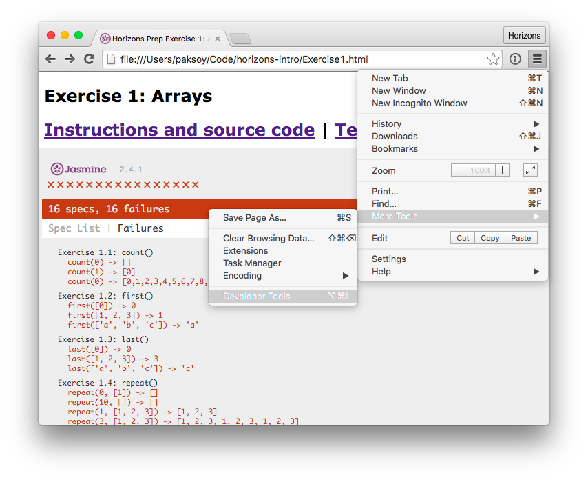

# JavaScript Basics Exercises

**Note**: For extra help with JavaScript check out
[CodeAcademy's great module on JavaScript][ca].

## Table of Contents

1. <a href="#arrays">Exercise 1: Arrays and Strings</a>
2. <a href="#functions">Exercise 2: Function Functions</a>
3. <a href="#arrays_functions">Exercise 3: Arrays and Function Functions</a>
4. <a href="#objects">Exercise 4: Objects</a>
5. <a href="#libraries">Exercise 5: Libraries</a>

## <a id="start">Getting Started</a>

Our goal with these 5 exercises is to create our own "library." A library is
collection of useful functions and data. Functions defined in a library are
designed to work well together. By combining these functions with each other
and with our code, we can solve new more complex problems without having to
start from scratch. Learning how to combine basic building blocks into more
complex structures is an essential skill in coding.

For exercise 1, we will build functions for common array operations. For
exercise 2, we will learn how to use functions within functions. For exercise
3, we will apply our knowledge of function functions to arrays. For exercise
4, we will learn how to use objects. And in exercise 5, the final exercise, we
will combine functions from the first 4 exercises to do do bigger things.

### Running Exercises

Files for this section can be found in the folder `1_javascript/1_basics`.
To start open `1_javascript/1_basics/Ex1_arrays_and_strings.html` in
[Google Chrome][chrome].

This page shows your progress on Exercise 1. Each subexercise is defined as a
test case that sets expectations of how your functions should behave. You can
see these test cases in `Exercise1_arrays_and_strings_tests.js`.


These exercises will run in your browser. They consist of a set of tests that
will be failing because of missing functions.

Your mission, should you choose to accept it, is to implement missing functions
and make these tests pass (i.e. succeed in running without errors).

## <a id="debugging">Debugging with Developer Tools</a>

Your code will sometimes behave in an unexpected way. When this happens, we
have to study our code more closely to find out what's going wrong. We call
this process debugging.

Google Chrome comes loaded with a powerful debugging tool called [Chrome Developer Tools][devtools].
You will find this useful while solving these exercises.

### Open Developer Tools Console

#### [:movie_camera: Video Tutorial: Finding Errors in your Code (password horizonites)](https://vimeo.com/165289361)



Open up `Exercise1_arrays_and_strings.html` in Chrome. Select the **Chrome menu**
 at the top-right of your browser window, then select
**Tools > Developer Tools**. Click on **Console** tab in the Developer Tools
window.

You can also do this with the keyboard shortcut **Cmd + Shift + J** on Mac and
**Ctrl + Shift + J** on Windows.

### Help yourself out with `console.log()`


Once you open up the **Console** tab, you'll notice that there are messages
already waiting for you. We generated these messages in the `count()` function
in `Exercise1_arrays_and_strings.js`.

```js
function count(n) {
  // YOUR CODE HERE
  console.log("somebody called count()");
}
```


Try changing this function to this, and see what happens. You too can add
`console.log()` messages to help you debug your code.

```js
function count(n) {
  // YOUR CODE HERE
  console.log("somebody called count() with", n);
}
```

## <a id="arrays">Exercise 1: Arrays and Strings</a>

**Note**: You should complete
[CodeAcademy's wonderful module on JavaScript][ca] before doing Exercise 1.


In the first exercise we implement some functions that operate on Arrays and Strings.

To begin open `Exercise1_arrays_and_strings.js` in your favorite text editor. We recommend [Atom](https://atom.io/).
Your solution code should go where it says `YOUR CODE HERE`.

As you add the correct solution to each function, refresh `Exercise1_arrays_and_strings.html` in
Chrome to see if your answer is works. When you have correctly written all the
functions you will see this. Congrats! You have completed the first exercise!


## <a id="functions">Exercise 2: Function functions</a>

JavaScript has "first class functions." That is to say, in JavaScript you can
treat functions the way you treat numbers or strings. You can assign
functions to variables, pass functions into other functions or return functions
from functions. So you can do things like:

```js
var sayHello = function() {
  console.log("Hello");
};

console.log("this is a function", sayHello);
```

If you feel confused, don't worry. Treating functions as objects (aka
functional programming) is very confusing at first. With some exercise you'll
get it.

Before digging into excercise 2 read
[Eloquent JavaScript's chapter 'Higher Order Functions'][es func].
It's a good introduction to Function Functions.

Once you're ready, open up `Exercise2_functions.html` in Chrome and `Exercise2_functions.js` in
your text editor.

## <a id="arrays_functions">Exercise 3: Arrays and Function Functions</a>

Now that we know how to use Arrays and Functions Functions, let's use
them at the same time. Open up `Exercise3_arrays_and_functions.html` in Chrome
and `Exercise3_arrays_and_functions.js` in your text editor and jump in.

## <a id="objects">Exercise 4: Objects</a>

Objects are a way of grouping useful data and functions in JavaScript. Using
objects, we can create mappings between names and values which is very useful.

To begin this exercise, open `Exercise4_objects.html` in Chrome and
`Exercise4_objects.js` in your text editor.

## <a id="libraries">Exercise 5: Libraries</a>

In the previous exercises, we've built up a trove of useful functions. In the
5th and final exercise, we combine these functions to do bigger and better
things. Thus, we learn how to build and use libraries.

To begin this exercise, open `Exercise5_libraries.html` in Chrome and
`Exercise5_libraries.js` in your text editor.

[es]: http://eloquentjavascript.net/
[es func]: http://eloquentjavascript.net/05_higher_order.html
[ca]: https://www.codecademy.com/learn/javascript
[chrome]: https://www.google.com/chrome/browser/desktop/
[download]: https://github.com/horizons-school-of-technology/prepwork/archive/master.zip
[devtools]: https://developer.chrome.com/devtools
