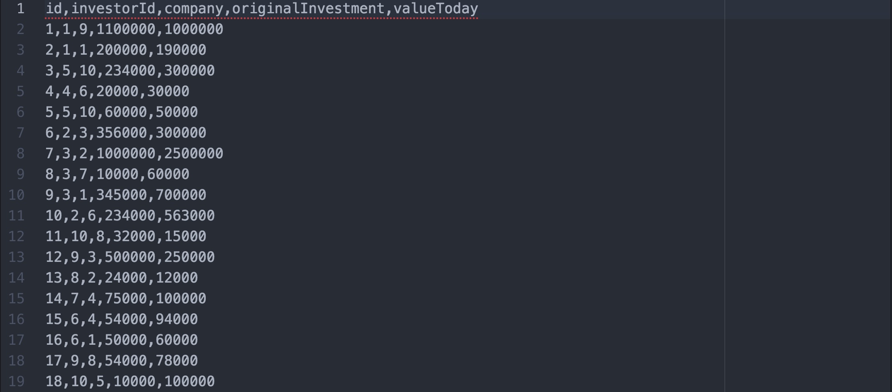
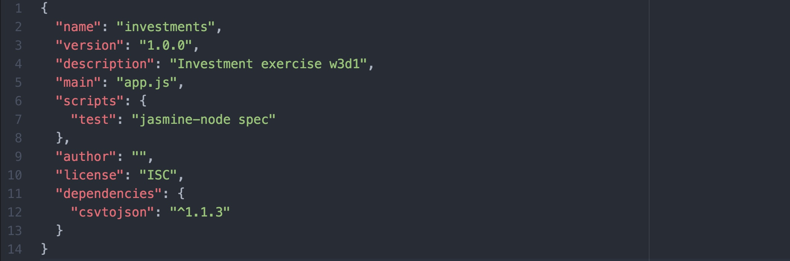
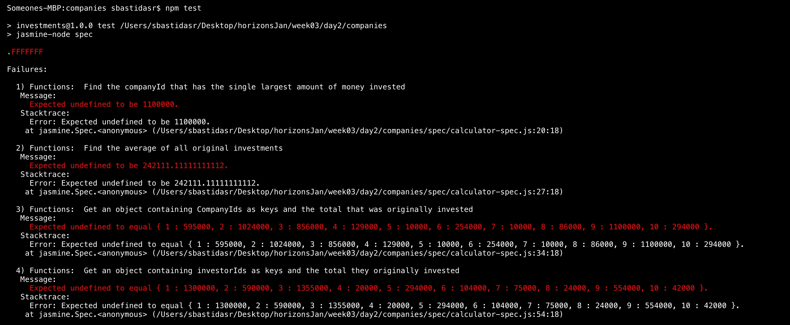

# Company Investment Reports Exercises

## Goal

The goal of this exercise is for you to get familiar with Node. We will cover
the basics of Node, files, npm, the package.json file, and running your app.
You will build an investment report app that takes in a `.csv` file and
performs calculations with the data on the files. CSV stands for
"comma-separated values". It is a format used to store tables of data (such as
spreadsheets) by separating each column with a comma.



The first line on a CSV file is usually the header, which specifies the names of the columns for the table. Our columns are `id`, `investorId`, `company`, `originalInvestment`, and `valueToday`. Each line after that corresponds to an investment. These values correspond to the following:

  + **id**: Each investment has a unique number associated with it.
  + **investorId**: Each investor has a number associated with them. An investor can be associated with multiple investments.
  + **company**: The number associated with each company. A company can also be associated with multiple investments.
  + **originalInvestment**: The original value of the stock bought by the investor.
  + **valueToday**: The current value of that same stock.

In order to be able to use this data, we will convert it to JSON objects that look like this:


Your app will perform calculations on these JSON objects to find out the best investors, companies with the most money, and so on.

## Instructions

### Part 1: Setting up the project

1. Open up your terminal and navigate to the `4_node/3_companies_csv` directory.
2. Install the [`jasmine-node`](https://www.npmjs.com/package/jasmine-node) NPM
   package for all Node projects on your computer.

   ```
   npm install -g jasmine-node
   ```

   `-g` (short for global) installs a package for all projects.

3. Add the [`csvjson`](https://github.com/pradeep-mishra/csvjson) NPM package to
   your current project.

   ```
   npm install --save csvjson
   ```

   `--save` updates your `package.json` and adds the given package
   to the `dependencies` section.
4. Run `npm install` to install all dependencies listed in your `package.json`.
5. Try running `npm test` in your terminal. Note how this prints out
   `Error: no test specified`. This is because we haven't told NPM how to
   run tests for our project yet.

   Create a new `"scripts"` section to your `package.json`. Inside this section
   set `"test"` to `"jasmine-node spec"`. Your `package.json` should now look
   like:

   

6. Run `npm test` again to verify that your tests are now running. If you get a
   similar screen with all the failing/passing tests you are ready to start
   developing!

    

### Part 2: Parsing CSVs

Open `4_node/3_companies_csv/app.js` file and fill in the places where you see `YOUR CODE HERE`. Look before each function for more detailed instructions.

You can now check your tests and see them failing/passing. Run `npm test` every time you make a change to make sure your code works.

### Part 3: Calculating Results

Open `4_node/3_companies_csv/functions.js` file and fill in the functions to
perform the different calculations. Each function has a short description of the
expected results and some hints to achieve them.

Every time you modify a function or want to check your progress, go to the
command line and run `npm test`.
