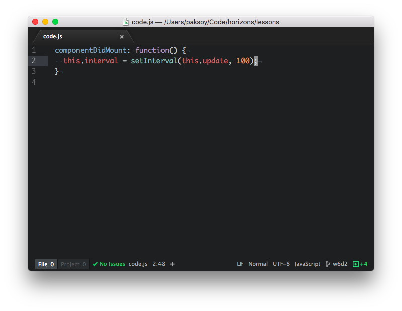
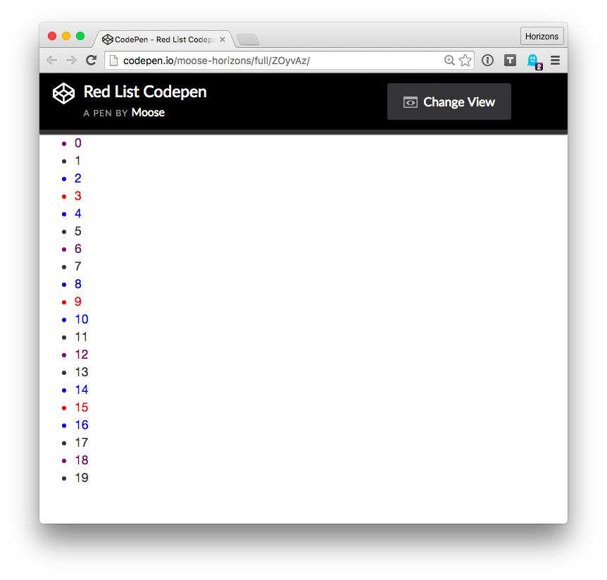

# React

Today you will be making your first big leap into developing more dynamic frontends. React is a declarative, efficient, and flexible JavaScript library for building user interfaces. It lets you compose complex UIs from small and isolated pieces of code called “components”

There can be a bit of a steep learning curve when you start learning React, but don't let this discourage you! Proactively ask questions when you encounter things that don't make sense!

For all the exercises today we will be using CodePen to run our React Code. Next time we will teach you how to run React projets from your terminal.

## Outline

1. React Intro
2. JSX
3. Rendering Elements
4. Components & Props
5. State & Lifecycle
6. Handling Events
7. Conditional Rendering
8. Lists & Keys
9. Forms
10. Lifting State Up
11. Composition vs. Inheritance
12. Tic-Tac-Toe Exercise

---

**[Note: The slides used in the videos can be found here](https://goo.gl/w7zRMr)**

## Section 1: React Intro

What is React anyways and why do we use it?

TODO:

- **[Watch Video][intro]**

## Section 2: JSX

One of the unique features of React (as opposed to Angular and Vue) is JSX. JSX allows us to use the power of JavaScript to create dynamic HTML.

TODO:

- **[Watch Video][jsx]**

## Section 3: Rendering Elements

React is a very efficient view library because it only updates DOM elements that need to be changed rather than re-rendering the whole page.

TODO:

- **[Watch Video][rendering]**

## Section 4: Components & Props

React is a very efficient view library because it only updates DOM elements that need to be changed rather than re-rendering the whole page.

TODO:

- **[Watch Video][components]**
- [Open this CodePen][ex1]. Update the code so that the `<Welcome />` component uses another prop called `age` and displays `age` as part of the rendered HTML.
  - Example output: "Hello, Andre. You are 22."
- [Open this CodePen][ex2]. Currently there is a `<PetContainer />` component that shows all 4 of my pets. Unfortunately I had to repeat a lot of code in `<PetContainer />`. Your task is to create **ONE** new component and use it inside of `<PetContainer />` to reduce the code repition.
  - Hints:
    - The HTML output should look the same, you should just be making the code better.
    - Think of how your new component should use props to get data.
    - You should use your new component exactly 4 times in `<PetContainer />`.

## Section 5: State & Lifecycle

State is an integral part of dynamic frontends and React, Angular, and Vue all have slightly different ways of handling state. Another key idea is the component lifecycle. React gives us many lifecycle hooks we can plug into to create more dynamic experiences.

TODO:

- **[Watch Video][state]**
- [Open this CodePen][ex3]. The `<Clock />` component is currently defined as a functional component. Convert `<Clock />` to be defined as a class component.
- [Open this CodePen][ex4]. The goal here is to build a timer using React component lifecycle methods.
  1. Implement the `update` function. This function should call `this.setState()` and update `this.state.secondsLeft` to be `(this.state.end - Date.now()) / 1000`.
  2. Implement the `componentDidMount` function. Set `this.state.end` to be `this.props.mins` added to the current time, and use `setInterval()` to call `this.update` periodically.
    
  3. Implement the `componentWillUnmount` function. Use `clearInterval()` to cancel the background update process.
  4. There are two timers on the page, verify that they count down from 1 and 5 minutes respectively.
       - Don't worry if the timers go below zero!

## Section 6: Handling Events

Web application wouldn't be very interesting if we had no way to handle user interactions. We do this using "events". In React, we leverage the power of JavaScript to handle events.

TODO:

- **[Watch Video][events]**
- [Open this CodePen][ex5]. The goal here is to build a basic counter by bringing together the concepts of state and event handlers.
  1. Implement the `increase()` function such that it increases the value of `this.state.counter` by 1 every time it is executed.
     - Hint: make sure you are using `this.setState()` properly since you cannot directly modify the `state`.
     - Hint: remember that `this.setState()` takes either an object, **OR** a callback function `cb(state,props)` which returns an object.
  2. Implement the `decrease()` function such that it decreases the value of `this.state.counter` by 1 every time it is executed.
  3. Add event handlers to the "Increase" and "Decrease" buttons in the `render()` function.
       - Hint: remember that you need to bind `increase()` and `decrease()` so that `this` is set properly. There are many ways to do this.
  4. Test out your counter!

## Section 7: Conditional Rendering

Often times we want to be able to show different content based on dynamic conditions. Conditional rendering is how we decide what gets shown dynamically.

TODO:

- **[Watch Video][conditional]**
- [Open this CodePen][ex6]. The goal here is to create a basic React app that allows us to control whether an image is shown on the screen. You will need to combine your knowledge of conditional rendering, handling events, and state management.
   1. Implement the `toggleDog()` function such that it sets `this.state.showDog = !this.state.showDog` every time it is clicked.
       - Hint: make sure you are using `this.setState()` properly since you cannot directly modify the `state`.
       - Hint: remember that `this.setState()` takes either an object, **OR** a callback function `cb(state,props)` which returns an object.
   2. Implement the `toggleCat()` function such that it sets `this.state.showCat = !this.state.showCat` every time it is clicked.
   3. Add event handlers to the "Toggle Dog" and "Toggle Cat" buttons in the `render()` function.
       - Hint: remember that you need to bind `toggleDog()` and `toggleCat()` so that `this` is set properly. There are many ways to do this. Try using a different approach than you used in the last section.
   4. Implement conditional rendering using the corresponding parts of the state and the `&&` operator to control when the dog and cat image are shown.
   5. Test out your app! When you click the "Toggle Dog" button the dog picture should disapear from the DOM. It should reappear if you click the "Toggle Dog" button again. The "Toggle Cat" button should work in the same way.

## Section 8: Lists & Keys

One of the most common use cases in React is querying a database for a list of objects and rendering them dynamically on the frontend. React lets us leverage the power of JavaScript's `Array.map()` for this purpose. When we use the `key=""` property properly React will ensure that our lists are rendered as efficiently as possible.

TODO:

- **[Watch Video][lists]**
- [Open this CodePen][ex7]. The goal of this exercise is to recreate the FizzBuzz programming interview question using React. You will need to use your knowledge of lists and conditional rendering.
    1. Make `<FizzBuzz />` display a bulleted list (`<ul>`) of `n` numbers (notice `n` is a prop).
        - Hint: You can use `new Array(5)` to create an empty array with length 5.
        - Hint: How migh `Array.map((curr, index) => {...})` help you?
    2. If a given number is divisible by 3 paint it red, if it's divisible by 2 paint it blue, if it's divisible by both 2 and 3 paint it purple. If a number neither divisible by 2 or 3, then display it in black.
        - The CSS Classes `red`, `blue`, and `black` have been provided to help you. Remember in React we use `className` instead of `class` when applying CSS classes.
    3. Your solution should look like this:
        

## Section 9: Forms

Another important factor of React applications is dealing with user input. We already learned how to handle user generated events (i.e. button clicks, etc.), but now we need to go over handling user generated input (i.e. textboxes).

TODO:

- **[Watch Video][forms]**
- [Open this CodePen][ex8]. The goal of this exercises is to use controlled form fields to tie the values of two text input fields together in React.
    1. There are two text input fields here. We want them to display the same data at all times, with one being all uppercase characters, and another being all lowercase characters. If you change one, the other one should change instantly.
    2. Create a new function `change(event)` inside the class. This function should take an `event` argument and update `this.state.text` using `this.setState` and `event.target.value`.
    3. Use the `change(event)` function you just created as the event handler for the two form fields.
    4. Try changing input fields, they should update at the same time.
    5. Now, modify input fields so that one shows uppercase characters whereas another one shows lowercase characters.

## Section 10: Lifting State Up

By now you should have some intuition about props and state in React. The next step is to understand where in your component tree you should put state and how to pass it down via props to other components. 

TODO:

- **[Watch Video][lifting]**
- [Open this CodePen][ex9]. The goal of this exercise is to extend the Counter example you did before while exploring the concept of lifting up state.
    1. First complete the `<Counter />` component like you did in Section 6 (refer to Section 6 if you need to review the directions).
    2. At this point you should have two independent counters that you can control. Now we want to add the ability to incrememt both counters at the same time using the "Increase Both" button. Consider if you can do this with the way the components are currently organized.
    3. To implement the "Increase Both" functionality we will need to move the state of each counter into the `<App />` component and pass it down as props.
       1. Add two state variables to the `<App />` component that will represent the two counters.
       2. Create a function in `<App />` that will increase any given counter by 1 (this function should take exactly 1 argument).
       3. Since we are extracting state from our `<Counter />` components we need to use props to pass down the current value of the counter and function that allows `<Counter />` to increase the current value of the counter. Think about why we need to pass both a value and a function here. If the counter state lives in `<App />`, how can `<Counter />` change it?
       4. Pass a counter value and the increase counter function from your `<App />` component down to each of the two `<Counter />` components. Rewrite your `<Counter />` component so it displays the counter value passed in as a prop, and uses the function passed in as a prop to handle events from the "Increase" button click. Strip out the state and state modifying functions you previously had in the `<Counter />` component. At this point you should be click the "Increase" button on both `<Counter />` components and it should work properly. The "Decrease" button should be broken.
       5. Repeat steps 3-5 except implement decrease functionality.
       6. Now we can finally implement our "Increase/Decrease Both" functionality. Create a function inside `<App />` that increases both counter states. Use this as the event handler for the "Increase Both" button.
       7. Repeat step 6 except implement decrease functionality.
       8. You should be done! Test out all the buttons and make sure they work as expected!

## Section 11: Composition vs. Inheritance

In object oriented programming we learn to use inheritance to simply our code, but in React we don't follow this paradigm. It's normally better to use composition (i.e. using components inside of components) rather than relying on inheritance.

TODO:

- **[Watch Video][composition]**

## Section 12: Tic-Tac-Toe Exercise

For this exercise you will be making Tic Tac Toe in React! This will be a good opportunity for you to practice all the things you've learned so far!

[Click Here](tic-tac-toe/) to get started!

[intro]: https://www.youtube.com/watch?v=d5n-XBpNhzI
[jsx]: https://www.youtube.com/watch?v=CoU7sK9_Joo
[rendering]: https://www.youtube.com/watch?v=jOMQ2Z0wH4A
[components]: https://www.youtube.com/watch?v=uHV8gXn3ljo
[ex1]: https://codepen.io/BitsofGood/pen/mzNrrL?&editors=0010
[ex2]: https://codepen.io/BitsofGood/pen/ZwNxBY?editors=0010
[state]: https://www.youtube.com/watch?v=hew-Zgk5C60
[ex3]: https://codepen.io/BitsofGood/pen/MLdLqL?editors=0010
[ex4]: https://codepen.io/BitsofGood/pen/qQOVvy
[events]: https://www.youtube.com/watch?v=Z2U1xfPLMb4
[ex5]: https://codepen.io/BitsofGood/pen/yZWwVm?editors=0010
[conditional]: https://www.youtube.com/watch?v=G1C6L5FgM2k
[ex6]: https://codepen.io/BitsofGood/pen/RvmOrv?editors=0010
[lists]: https://www.youtube.com/watch?v=mgcm_NlwkW0
[ex7]: https://codepen.io/BitsofGood/pen/wQKPOa?editors=0010
[forms]: https://www.youtube.com/watch?v=4j-i6TfdXWk
[ex8]: https://codepen.io/BitsofGood/pen/VVvrGE?editors=0010
[lifting]: https://www.youtube.com/watch?v=mT3cCLhMQMQ
[ex9]: https://codepen.io/BitsofGood/pen/WmeRWY
[composition]: https://www.youtube.com/watch?v=9WZxVhiuNn0
