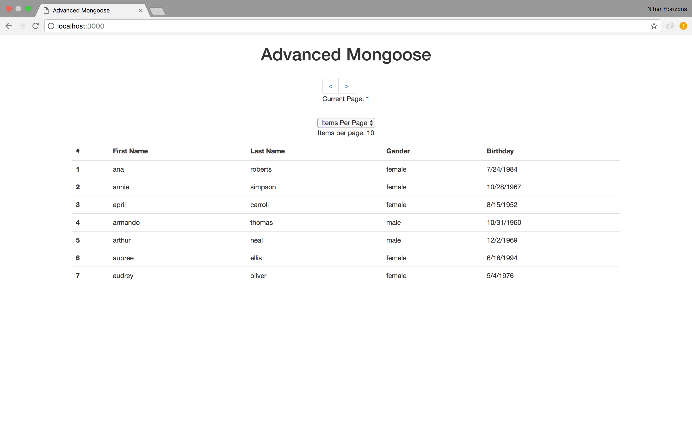

# Advanced Mongoose

Today we will learn about some advanced mongoose features

## Table of Contents


- exec() (p1)
- skip() (p1)
- limit() (p1)
- sort() (p1)
- paginate (p1) (books)
- Aside: Schema (p2)
- populate() (p2) (comments)
- Aside: Ref (p2)
- Virtuals (p2)
- Methods (p2)
- Statics (p2)
- Promise.all (mongo-loader)
- Twitter exercises

---

## Section 1: `exec()`

### [Watch me](https://www.youtube.com/watch?v=QZWuyz3cipw)

The Exec function helps us execute chained and singular Mongoose queries.

1. Run `npm start` in the terminal to start our server

1. Go to `localhost:3000` in your browser, notice that our browser window
looks like

    <details><summary>
    Screenshot
    </summary><p>

    

    </p></details>

1. Open `bootcamp/10_advanced_mongoose/examples/part1/server.js` in Atom

1. Modify the `GET /` route to use `.exec()` to execute the User query

1. Refresh the browser window. It should look the exact same!

---

## Section 2: `skip`
### [Watch me](https://www.youtube.com/watch?v=ZROrzBVTtSM)

The Skip function helps us skip over a specified number of documents in mongoose queries.

1. Go to `localhost:3000` in your browser, notice that our browser window
looks like

    <details><summary>
    Screenshot
    </summary><p>

    

    </p></details>

1. Modify the `GET /` route in `server.js` to skip over the first 7 User documents

    Your output in the browser should now look like

    <details><summary>
    Screenshot
    </summary><p>

    

    </p></details>

---

## Section 3: `limit()`
### [Watch me](https://www.youtube.com/watch?v=lnNbVmZOpdQ)

The limit function helps us limit the number of documents that are returned.

1. Modify the `GET /` route in `server.js` to skip over the first 7 users
and limit the number users returned to 7

    Your output in the browser should now look like

    <details><summary>
    Screenshot
    </summary><p>

    

    </p></details>


---

## Section 4: `sort()`
### [Watch me](https://www.youtube.com/watch?v=5jaI_2NfMSc)

The sort function helps us sort the returned documents

1. Modify the `GET /` route in `server.js` to sort users by their first name,
skip the first 7 and display the next 7 users

    <details><summary>
    Hint
    </summary><p>

    Sort based on a property of an object inside a document by using the dot
    notation i.e. `sort({'name.last': -1})` (reverse sort by last name)

    </p></details>

    Your output in the browser should now look like

    <details><summary>
    Screenshot
    </summary><p>

    

    </p></details>

1. Modify the `GET /` route in `server.js` to display the 7 oldest users

    Your output in the browser should now look like

    <details><summary>
    Screenshot
    </summary><p>

    

    </p></details>

---

## Section 5: Paginate

1. Using a combination of the above functions, alphabetically sort users by
first name and paginate the data

    Two variables are provided for you `pageNumber` and `limit`

    `pageNumber` indicates which page of users is currently being displayed.
    The first page has index `1`.

    `limit` indicates how many users should be displayed per page (i.e.
    Items Per Page).

    <details><summary>
    Hint
    </summary><p>

    The number of users you `.skip()` depends on both "items per page" and
    the current page index.

    </p></details>

1. **Results:**

    If you are displaying 10 items per page, your output should look like
    [this](http://www.giphy.com/gifs/l0IydfuFRBj7pqxCE/fullscreen);

    If you are displaying 15 items per page, your output should look like
    [this](http://www.giphy.com/gifs/3ohzdMi1UiBdVAKidy/fullscreen).


## Aside: Schema
### [Watch me](https://www.youtube.com/watch?v=sCgAmdoTxXs)

## Section 6: `populate()`
### [Watch me](https://www.youtube.com/watch?v=3eHOL46XTsc)

1. Edit `10_advanced_mongoose/examples/part2/pet.js` and change the `owner` property of the `Pet` model to
be reference (i.e. a `ref`) to the `User` model

    <details><summary>
    Hint
    </summary><p>

    Set the `type` of `owner` to be `Schema.ObjectId` and `ref` to be `User`

    </p></details>

1. Edit the `GET /pets` route in `10_advanced_mongoose/examples/part2/server.js` and `populate` the `owner`
property of each

    <details><summary>
    Hint
    </summary><p>

    Switch the query to use `.exec()` and add `.populate('owner')`

    </p></details>

3. Go to `localhost:3000/pets` and verify that the owner's first name, last
name and birthday are properly displayed

    <details><summary>
    Before
    </summary><p>

    

    </p></details>

    <details><summary>
    After
    </summary><p>

    

    </p></details>

## Aside: Ref
### [Watch me](https://youtu.be/YWX5bgLIvKE)

## Section 7: Virtuals
### [Watch me](https://vimeo.com/album/4604349/video/218990923)

1. Edit `week04/day2/examples/part2/user.js` and add an `age` virtual property the `User` schema

    The `age` virtual property should contain the age of the current user
    in years rounded down to the nearest integer.

    <details><summary>
    Hint
    </summary><p>

    This function calculates the age of user given a birthday (date object)

    ```javascript
    function getAge(birthday) {
      var ageDifMs = Date.now() - birthday.getTime();
      var ageDate = new Date(ageDifMs); // miliseconds from epoch
      return Math.abs(ageDate.getUTCFullYear() - 1970);
    }
    ```

    [source](https://stackoverflow.com/a/21984136)

    </p></details>

3. Go to `localhost:3000/` and verify that the `age` of each user is displayed

    <details><summary>
    Before
    </summary><p>

    

    </p></details>

    <details><summary>
    After
    </summary><p>

    

    </p></details>

## Section 8: Methods
### [Watch me](https://vimeo.com/221365169)

1. Edit `week04/day2/examples/part2/user.js` and add a method called `toggleGender` to the
`User` schema

    When called `toggleGender` should set the `gender` property of the current
    user to be `male` if the current user is `female` and vice versa.

    You do **not** need to `.save()` the user after modifying it.

    You can see how this static is called in `week04/day2/examples/part2/server.js` in the
    `GET /toggle` route
2. Go to `localhost:3000/toggle` in your browser, every time you refresh
the page you should see the gender alternate between `male` and `female`

    <details><summary>
    Screenshot
    </summary><p>

    

    </p></details>


## Section 9 : Statics
### [Watch me](https://vimeo.com/album/4604349/video/219184740)

1. Edit `week04/day2/examples/part2/user.js` and add a static called `findByName` to the
`User` schema

    `findByName` should take a String `name` argument and a callback
    function, and should find all users with that first name then
    call the callback function with `error, users`.

    You can see how this static is called in `week04/day2/examples/part2/server.js` in the
    `GET /users/:name` route

    <details><summary>
    Hint
    </summary><p>

    Inside `findByName` call `.find({"name.first": name})` from the
    user model.

    </p></details>

2. Go to `localhost:3000/users/darrell` in your browser, you should see

    <details><summary>
    Screenshot
    </summary><p>

    

    </p></details>
