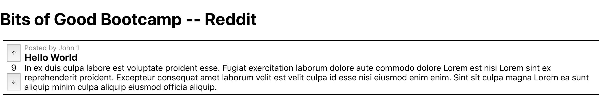
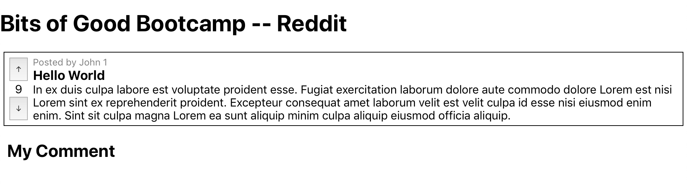
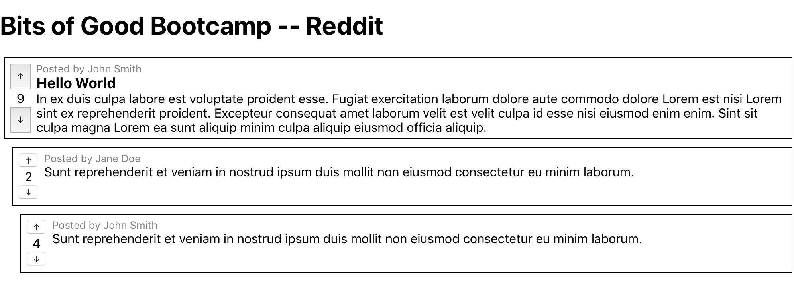

# React with APIs

By this point you should have a basic understanding of how React works from comleting the exercises in `09_react` (i.e. you should be familiar with the terms: `Component`, `Functional vs Class Components`, `props`, `state`, `this.setState()`, `componentDidMount`, etc.).

Everything you've done so far has been pretty trivial and mainly focused on learning how React works. Today we're going to take a leap forward and use React to plug into an API and start showing/creating real data.

The Bits of Good Tech Team has gone ahead and built a basic Reddit API that you will use as your backend while you create a frontend using React. Let's take a second to check out the data models we will be using.

## Models

These are the data models used for this basic implementation of Reddit. The data you receive from the API will follow this schema.

### Post

```javascript
{
  id: {String, auto-generated},
  author: {String, required},
  title: {String, required},
  text: {String, required},
  upVotes: {Number, default:0},
  downVotes: {Number, default: 0},
  comments: [Comment],
  createdAt: {String, auto-generated},
  updateAt: {String, auto-generated}
}
```

### Comment

```javascript
{
  id: {String, auto-generated},
  author: {String, required},
  text: {String, required},
  upVotes: {Number, default:0},
  downVotes: {Number, default: 0},
  comments: [Comment],
  createdAt: {String, auto-generated},
  updateAt: {String, auto-generated}
}
```

## API

- The API is hosted off: https://bog-reddit.herokuapp.com/api/v1/.
- Check out the API docs available here: https://bog-reddit.herokuapp.com/api-docs
- The two main API endpoints you will be using are:
  - https://bog-reddit.herokuapp.com/api/v1/posts
  - https://bog-reddit.herokuapp.com/api/v1/comments

## Outline

1. Sending Requests with Axios
2. Create React App
3. Laying the Groundwork
4. Mock up Post Component
5. Mock up Comment Component
6. Using Props
7. Loading Real Data

---

## Section 1: Sending Requests with Axios

In order to connect a React application to an API we first need to learn how to send HTTP requests using JavaScript. There are many libraries that implement this functionality as well as a native JavaScript solution called `fetch`. For this tutorial we will use `axios` but you should understand that this is just an implementation decision and there are many other valid options.

TODO:

1. **[Watch Video: HTTP Methods & Status Codes][http-methods]**
2. **[Watch Video: Axios Demo][axios]**

## Section 2: Create React App

In the previous set of React exercises you did all your coding using CodePen. This is great for learning but obviously this isn't how we want to develop our entire React applications. Unfortunately there is some non-trivial boilerplate code to get React set up if you go for it on your own. Luckily Facebook has gone ahead and created a tool called `Create React App` that handles setting up all the boilerplate for us. So we will be using Facebook's [Create React App][cra] to help us set up the frontend of our application.

TODO:

1. Navigate to `/10_react_with_apis/`.

2. Run `Create React App` to create your React boilerplate.
    This will automatically download all the code and dependencies that the React App needs.
    It may take a minute!

      ```sh
      npx create-react-app reddit
      ```

3. Now you have a `reddit` folder with all the code for the boilerplate React App.
    Change directory to the React App you just created:

      ```sh
      cd reddit
      ```

4. Now we will actually run the React App so you can see the website. Start it with the following command:

    ```sh
    npm start
    ```

5. Now open [http://localhost:3000/][localhost] in your web browser to see your (simple) web app!

## Section 3: Laying the Groundwork

Great! At this point we should have all the React boilerplate set up and now we're ready to start setting up the components we need for our project.

TODO:

1. Navigate to the `reddit/src` directory. This is where all your React component should live.
2. Inside the `reddit/src/App.js` file delete all the content inside the `render()` function and just return a `<h1>` tag says something like "Bits of Good Bootcamp -- Reddit".
3. Inside the `reddit/src` directory create a new file and call it `Post.js`. In this file you should creat a **class based component** called `Post`. For now have the render function just return `<h2> My Post </h2>`. After your React class declaration make sure to export your component from the file using `export default Post`.
4. Inside `App.js` import your `Post` component and add it to the render function.
5. At this point you should have two components (`App.js` and `Post.js`) and application should look like this:


## Section 4: Mock up Post Component

When creating a new component, a very common practice is to use mock data to build out the look & feel of the component then replace the mock data with props & state later. Let's do this with the `Post` component. This tutorial will guide you through the basics of mocking up the `Post` component, but you are welcome to go above and beyond with the layout & formatting.

TODO:

1. First lets consider what data we need to be able to show in our `Post` component.
    - Author
    - Title
    - Text
    - Up votes
    - Down votes
    - Comments
2. Go ahead flush out the `render()` function inside the `Post` component to display this data. For now don't worry about displaying comments.
    - Hint: you may want to create a `Post.css` file for your styling and import it into your `Post.js` file using `import './Post.css`. Inside the `render()` function in your `Post` component you, remember you can appy css classes using `className` (ex: `<div className="post"></div>`)

    Here is an example of what your `Post` component might look like. It's okay if yours looks different -- the key is that you are displaying all the relevant pieces of data.
    

## Section 5: Mock up Comment Component

Now that we have mocked up our `Post` component let's do the same for a `Comment` component.

TODO:

1. Create a `Comment.js` file in your `reddit/src` directory.
2. Create a **class based component** and have the `render()` function return `<h2>My comment</h2>`.
3. Import your `Comment` component into the `Post.js` file and add your `<Comment/>` underneath your post. Here is an example of what it may look like:

4. Now let's consider what data we need to be able to show in our `Comment` component.
   - Author
   - Text
   - Up votes
   - Down votes
   - Comments
5. Just like we did for the `Post` component let's flush out the `render()` function inside the `Comment` component to display this data. Again, don't worry about displaying comments on your comment at this point.
    - Hint: The `Post` and `Comment` components are fairly similar. You may be able to reuse a lot of your styling.

    Here is an example of what your app might look like after flushing out the `Comment` component with mock data.
    

## Section 6: Using Props

As you have seen, using mock data to flesh out the styling of your React components is a great way to get started quickly and get a feel for your app. Now let's replace our mock data with props to make our components reusable.

TODO:

1. Now we want to use props to pass data in rather than having dummy data in our `render()` functions. Since we haven't conneceted to our backend API yet we can create a dummy object that simulates the data we expect to get from our backend. You are free to create your own dummy data or use the one provided below:

    ```javascript
    const postData = {
      id: "1",
      author: "John Smith",
      title: "Hello World",
      text: `In ex duis culpa labore est voluptate proident esse. Fugiat
      exercitation laborum dolore aute commodo dolore Lorem est nisi Lorem
      sint ex reprehenderit proident. Excepteur consequat amet laborum velit
      est velit culpa id esse nisi eiusmod enim enim. Sint sit culpa magna
      Lorem ea sunt aliquip minim culpa aliquip eiusmod officia aliquip.`,
      upVotes: 10,
      downVotes: 1,
      comments: [
        {
          id: "2",
          author: "Jane Doe",
          text: `Sunt reprehenderit et veniam in nostrud ipsum duis mollit non eiusmod consectetur eu minim laborum.`,
          upVotes: 3,
          downVotes: 1,
          comments: [
            {
              id: "3",
              author: "John Smith",
              text: `Sunt reprehenderit et veniam in nostrud ipsum duis mollit non eiusmod consectetur eu minim laborum.`,
              upVotes: 5,
              downVotes: 1,
              comments: []
            }
          ]
        }
      ]
    };
    ```

2. Take your dummy `postData` and paste it into the `App.js` file.
3. Pass your `postData` to the `Post` component in the render function inside of `App.js` as a prop called data (i.e. `<Post data={postData}/>`).
4. Update your `Post` component so that all the data being displayed is coming from props rather than static dummy data in the render function. Remember in class based components you can access data passes in as props using `this.props.data.author`.
5. Previously we had our `<Comment />` component displayed in our `Post` component's `render()` function. Now we only want to display the `<Comment />` component if a given post has comments assoicated with it (i.e. `this.props.data.comments`). Also consider that a given post may have any number of comments that we need to display. How can we handle this?
    - Hint: how might `this.props.data.comments.map(...)` be helpful here?
6. Update your `Comment` component so that all the data being dispayed is coming from props rather than static dummy data in the render function.
7. In reddit you can comment on a comment. We want to be able to replicate this functionality too. Use the same approach as in step 5 to display comments on a comment.

    Here is an example of what your app might look like after converting `Post` and `Comment` to display data from `props` if you used the dummy `postData` provided above.
    

## Section 7: Loading Real Data

Amazing! At this point we have created a rough mock of our Reddit app. Now it's time to connect our React app to our backend API so we can start loading real posts and comments rather than just dummy data.

TODO:

1. For this exercise we are going to use Axios to make requests to our API. First let's add `axios` to our project by running `npm install axios`.
2. Open your `App.js` file and import `axios`.
3. Now we have to figure out where inside our React component we should make our API call. Let's consider some options:
   - What if we make API requests in the `render()` function?
     - Bad. Remember the render function gets called **a lot**. Everytime a piece of `state` or a `prop` changes `render()` gets called. We don't need/want to make API requests that often. We just need to load data once when our component is created
   - What about the `constructor()` function?
     - Also not ideal. The constructor gets called before the React component gets attached to the DOM. We want to keep the constructor as small as possible and avoid doing API work here.
   - After the component gets mounted (i.e. `componentDidMount()`)?
     - We have a winner! The [React documentation][didMount] specifically recommends making network requests here. The `componentDidMount()` lifecycle hook gets called after the `constructor()` is run and DOM nodes are created.
4. Add a `constructor()` function to your `App` component. Inside the constrctor we will create a piece of state to hold the posts we will load. Initialize this piece of state to be `null`. We want to initialize `this.state.posts` to be null initially until we successfully load the posts from the API. More on this later...

    <details>
      <summary>SPOILER: Show code to add</summary>

      ```javascript
        constrcutor(props) {
          super(props);
          this.state = { posts: null};
        }
      ```

    </details>

5. Add a `componentDidMount()` function to your `App` component. Inside this function you should use `axios` to make a `GET` request to the correct endpoint on the backend API to get the list of all posts. Once you get the array of posts, you should update the state to contain the array of posts.
    - Hint: the API endpoint you should use is `https://bog-reddit.herokuapp.com/api/v1/posts`

    <details>
      <summary>SPOILER: Show code to add</summary>

      ```javascript
        componentDidMount() {
          axios.get("https://bog-reddit.herokuapp.com/api/v1/posts")
            .then(posts => this.setState({ posts }))
            .catch(err => console.log(err));
        }
      ```

    </details>

6. Now that we have a way to load the posts from the backend using `componentDidMount()` we need to use the data inside of `render()` to display the posts.
  TO BE CONTINUED!

[http-methods]: https://youtu.be/DtR_6krv57U
[axios]: https://youtu.be/r_w_gbxDvDY
[cra]: https://github.com/facebook/create-react-app
[localhost]: http://localhost:3000/
[didMount]: https://reactjs.org/docs/react-component.html#componentdidmount