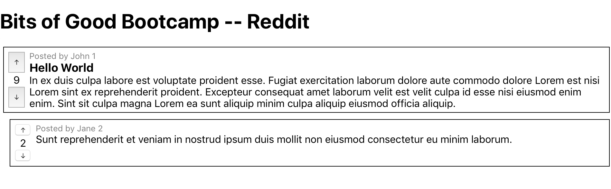
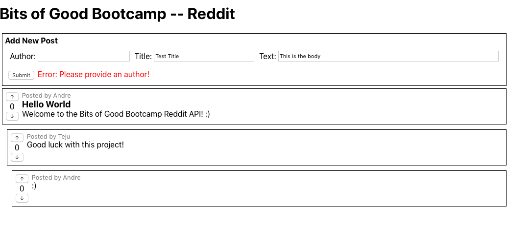

# React with APIs

By this point you should have a basic understanding of how React works from comleting the exercises in `09_react` (i.e. you should be familiar with the terms: `Component`, `Functional vs Class Components`, `props`, `state`, `this.setState()`, `componentDidMount()`, etc.).

Everything you've done so far has been pretty trivial and mainly focused on learning how React works. Today we're going to take a leap forward and use React to plug into an API and start using real data.

The Bits of Good Tech Team has gone ahead and built a basic Reddit API that you will use as your backend while you create a frontend using React. Let's take a second to check out the data models we will be using.

## Outline

- [React with APIs](#react-with-apis)
  - [Outline](#outline)
  - [Models](#models)
    - [Post](#post)
    - [Comment](#comment)
  - [API](#api)
  - [Section 1: Sending Requests with Axios](#section-1-sending-requests-with-axios)
  - [Section 2: Create React App](#section-2-create-react-app)
  - [Section 3: Laying the Groundwork](#section-3-laying-the-groundwork)
  - [Section 4: Mock up Post Component](#section-4-mock-up-post-component)
  - [Section 5: Mock up Comment Component](#section-5-mock-up-comment-component)
  - [Section 6: Using Props](#section-6-using-props)
  - [Section 7: Loading Real Data](#section-7-loading-real-data)
  - [Section 8: Creating New Posts](#section-8-creating-new-posts)
  - [Section 9: Deleting Posts](#section-9-deleting-posts)
  - [Section 10: Upvoting & Downvoting Posts](#section-10-upvoting--downvoting-posts)
  - [Section 11: Replying to Posts](#section-11-replying-to-posts)
  - [Section 12: Finishing Comments](#section-12-finishing-comments)
  - [Section 13: Conclusion](#section-13-conclusion)


## Models

These are the data models used for this basic implementation of Reddit. The data you receive from the API will follow this schema.

### Post

```javascript
{
  id: {String, auto-generated},
  author: {String, required},
  title: {String, required},
  text: {String, required},
  upVotes: {Number, default:0},
  downVotes: {Number, default: 0},
  comments: [Comment],
  createdAt: {String, auto-generated},
  updateAt: {String, auto-generated}
}
```

### Comment

```javascript
{
  id: {String, auto-generated},
  author: {String, required},
  text: {String, required},
  upVotes: {Number, default:0},
  downVotes: {Number, default: 0},
  comments: [Comment],
  createdAt: {String, auto-generated},
  updateAt: {String, auto-generated}
}
```

## API

- The API is hosted off: https://bog-reddit.herokuapp.com/api/v1/.
- Check out the API docs available here: https://bog-reddit.herokuapp.com/api-docs
- The two main API endpoints you will be using are:
  - https://bog-reddit.herokuapp.com/api/v1/posts
  - https://bog-reddit.herokuapp.com/api/v1/comments


---

## Section 1: Sending Requests with Axios

In order to connect a React application to an API we first need to learn about HTTP Methods and how to send HTTP requests using JavaScript. There are many libraries that implement this functionality as well as a native JavaScript solution called `fetch`. For this tutorial we will use `axios` but you should understand that this is just an implementation decision and there are many other valid options.

TODO:

1. **[Watch Video: HTTP Methods & Status Codes][http-methods]**
2. **[Watch Video: Axios Demo][axios]**

## Section 2: Create React App

In the previous set of React exercises you did all your coding using CodePen. This is great for learning but obviously this isn't how we want to develop our entire React applications. Unfortunately, there is some non-trivial boilerplate code to get React set up if you go for it on your own. Luckily, Facebook has gone ahead and created a tool called `Create React App` that handles setting up all the boilerplate for us. So we will be using Facebook's [Create React App][cra] to help us set up the frontend of our application.

TODO:

1. Navigate to `/10_react_with_apis/`.

2. Run `Create React App` to create your React boilerplate.
    This will automatically download all the code and dependencies that the React App needs.
    It may take a minute!

      ```sh
      npx create-react-app reddit
      ```

3. Now you have a `reddit` folder with all the code for the boilerplate React App.
    Change directory to the React App you just created:

      ```sh
      cd reddit
      ```

4. Now we will actually run the React App so you can see the website. Start it with the following command:

    ```sh
    npm start
    ```

5. Now open [http://localhost:3000/][localhost] in your web browser to see your (simple) web app!

## Section 3: Laying the Groundwork

Great! At this point we should have all the React boilerplate set up and now we're ready to start setting up the components we need for our project.

TODO:

1. Navigate to the `reddit/src` directory. This is where all your React component should live.
2. Inside the `reddit/src/App.js` file delete all the content inside the `render()` function and just return a `<h1>` tag says something like "Bits of Good Bootcamp -- Reddit".
3. Inside the `reddit/src` directory create a new file and call it `Post.js`. In this file you should create a **class-based component** called `Post`. For now have the render function just return `<h2> My Post </h2>`. After your React class declaration make sure to export your component from the file using `export default Post`.
4. Inside `App.js` import your `Post` component and add it to the render function.
5. At this point you should have two components (`App.js` and `Post.js`) and application should look like this:


## Section 4: Mock up Post Component

When creating a new component, a very common practice is to use mock data to build out the look & feel of the component then replace the mock data with props & state later. Let's do this with the `Post` component. This tutorial will guide you through the basics of mocking up the `Post` component, but you are welcome to go above and beyond with the layout & formatting.

TODO:

1. First lets consider what data we need to be able to show in our `Post` component.
    - Author
    - Title
    - Text
    - Up votes
    - Down votes
    - Comments

    We will eventually be filling in this information by passing in a `data` prop; i.e., Author would be `{this.props.data.author}`, and so on.
2. Go ahead and implement the `render()` function inside the `Post` component to display this data. For now don't worry about displaying comments.
    - Hint: you may want to create a `Post.css` file for your styling and import it into your `Post.js` file using `import './Post.css`. Inside the `render()` function in your `Post` component you, remember you can appy css classes using `className` (ex: `<div className="post"></div>`)

    Here is an example of what your `Post` component might look like. It's okay if yours looks different -- the key is that you are displaying all the relevant pieces of data.
    

## Section 5: Mock up Comment Component

Now that we have mocked up our `Post` component let's do the same for a `Comment` component.

TODO:

1. Create a `Comment.js` file in your `reddit/src` directory.
2. Create a **class based component** and have the `render()` function return `<h2>My comment</h2>`.
3. Import your `Comment` component into the `Post.js` file and add your `<Comment/>` underneath your post. Here is an example of what it may look like:

4. Now let's consider what data we need to be able to show in our `Comment` component.
   - Author
   - Text
   - Up votes
   - Down votes
   - Comments
5. Just like we did for the `Post` component let's implement the `render()` function inside the `Comment` component to display this data. Again, don't worry about displaying comments on your comment at this point.
    - Hint: The `Post` and `Comment` components are fairly similar. You may be able to reuse a lot of your styling.

    Here is an example of what your app might look like after flushing out the `Comment` component with mock data.
    

## Section 6: Using Props

As you have seen, using mock data to flesh out the styling of your React components is a great way to get started quickly and get a feel for your app. Now let's replace our mock data with `props` to make our components reusable.

TODO:

1. Now we want to use `props` to pass data in rather than having dummy data in our `render()` functions. Since we haven't connected to our backend API yet we can create a dummy object that simulates the data we expect to get from our backend. You are free to create your own dummy data or use the one provided below:

    ```javascript
    const postData = {
      id: "1",
      author: "John Smith",
      title: "Hello World",
      text: `In ex duis culpa labore est voluptate proident esse. Fugiat
      exercitation laborum dolore aute commodo dolore Lorem est nisi Lorem
      sint ex reprehenderit proident. Excepteur consequat amet laborum velit
      est velit culpa id esse nisi eiusmod enim enim. Sint sit culpa magna
      Lorem ea sunt aliquip minim culpa aliquip eiusmod officia aliquip.`,
      upVotes: 10,
      downVotes: 1,
      comments: [
        {
          id: "2",
          author: "Jane Doe",
          text: `Sunt reprehenderit et veniam in nostrud ipsum duis mollit non eiusmod consectetur eu minim laborum.`,
          upVotes: 3,
          downVotes: 1,
          comments: [
            {
              id: "3",
              author: "John Smith",
              text: `Sunt reprehenderit et veniam in nostrud ipsum duis mollit non eiusmod consectetur eu minim laborum.`,
              upVotes: 5,
              downVotes: 1,
              comments: []
            }
          ]
        }
      ]
    };
    ```

2. Take your dummy `postData` and paste it into the `App.js` file.
3. Pass your `postData` to the `Post` component in the `render()` function inside of `App.js` as a `prop` called `data` (i.e., `<Post data={postData}/>`).
4. Update your `Post` component so that all the data being displayed is coming from `props` rather than static dummy data in the render function. Remember, in class-based components, you can access data passed in as `props` using `this.props.data.author`.
5. Previously we had our `<Comment />` component displayed in our `Post` component's `render()` function. Now we only want to display the `<Comment />` component if a given post has comments assoicated with it (i.e. `this.props.data.comments` is not empty). Also consider that a given post may have any number of comments that we need to display. How can we handle this?
    - Hint: how might `this.props.data.comments.map(...)` be helpful here?
6. Update your `Comment` component so that all the data being dispayed is coming from `props` rather than static dummy data in the `render()` function.
7. In reddit you can comment on a comment. We want to be able to replicate this functionality too. Use the same approach as in step 5 to display comments on a comment.

    Here is an example of what your app might look like after converting `Post` and `Comment` to display data from `props` if you used the dummy `postData` provided above.
    

## Section 7: Loading Real Data

Amazing! At this point we have created a rough mock of our Reddit app. Now it's time to connect our React app to our backend API so we can start loading real posts and comments rather than just dummy data.

TODO:

1. For this exercise we are going to use Axios to make requests to our API. First, let's add `axios` to our project by running `npm install axios`.
2. Open your `App.js` file and import `axios` using `import axios from "axios";`.
3. Now we have to figure out where inside our React component we should make our API call. Let's consider some options:
   - What if we make API requests in the `render()` function?
     - Bad. Remember the render function gets called **a lot**. Everytime a piece of `state` or a `prop` changes `render()` gets called. We don't need/want to make API requests that often. We just need to load data once when our component is created
   - What about the `constructor()` function?
     - Also not ideal. The constructor gets called before the React component gets attached to the DOM. We want to keep the constructor as small as possible and avoid doing API work here.
   - After the component gets mounted (i.e. `componentDidMount()`)?
     - We have a winner! The [React documentation][didMount] specifically recommends making network requests here. The `componentDidMount()` lifecycle hook gets called after the `constructor()` is run and DOM nodes are created.
4. Add a `constructor()` function to your `App` component. Inside the constructor we will create a piece of `state` to hold the posts we will load. Initialize this piece of `state` to be `[]`. For simplicity we want to initialize `this.state.posts` to be an empty array until we successfully load the posts from the API.

    - <details>
      <summary>SPOILER: Show code to add</summary>

      ```javascript
        constrcutor(props) {
          super(props);
          this.state = { posts: []};
        }
      ```

    </details>

5. Add a `componentDidMount()` function to your `App` component. Inside this function you should use `axios` to make a `GET` request to the correct endpoint on the backend API to get the list of all posts. Once you get the array of posts, you should update the `state` to contain the array of posts.
    - Hint: the API endpoint you should use is `https://bog-reddit.herokuapp.com/api/v1/posts`

    - <details>
      <summary>SPOILER: Show code to add</summary>

      ```javascript
        componentDidMount() {
          axios.get("https://bog-reddit.herokuapp.com/api/v1/posts")
            .then(({data}) => this.setState({ posts: data.posts }))
            .catch(err => console.log(err));
        }
      ```

    </details>

6. Now that we have a way to load the posts from the backend using `componentDidMount()`, use the piece of `state` data `this.state.posts` inside of `render()` to display the posts.
     - Hint: use `this.state.posts.map(...)` to help you.
     - Reminder: Don't forget to set a `key` on the elements inside your `.map()` otherwise React will throw a warning.
      - <details>
        <summary>SPOILER: Show code to add</summary>

        ```javascript
          render() {
            return (
              <div>
                <h1>Bits of Good Bootcamp -- Reddit</h1>
                {this.state.posts.map(cur => (
                  <Post key={cur._id} post={cur} />
                ))}
              </div>
            );
          }
        ```

      </details>

7. Great work so far! Lets take a second to recap what we have done up to this point.
    - Used Create React App to generate boilerplate from scratch
    - Mocked up our components with fake data
    - Introduced props to make our components dynamic
    - Displayed real data loaded from an API using Axios

    This general flow of checkpoints is fairly common and is something you'll likely find yourself doing as you start working on more React projects.

    Here is an example of what your app might look like after loading real data from the backend API. Note your results will likely be different as there may be more posts/comments in the database.
        

## Section 8: Creating New Posts

Now that we are displaying real reddit data from our API, let's work on adding a way to create new posts! Although there are many ways one might want to incorporate adding new posts into your UI, for the sake of simplicity lets just add a couple text boxes above our first post that allow us to enter a `author`, `title`, and `text`.

TODO:

1. Create a new class component called `AddPost`.
2. Import `AddPost` into `App.js` and insert it into the `render()` function below your header and above your list of posts.
   - <details>
     <summary>SPOILER: Show code to add</summary>

     ```javascript
       render() {
         return (
           <div>
             <h1>Bits of Good Bootcamp -- Reddit</h1>
             <AddPost />
             {this.state.posts.map(curr => (
               <Post key={curr._id} post={curr} />
             ))}
           </div>
         );
       }
     ```

     </details>

3. Go back to your `AddPost` component and insert three text `<input />` for an author, title, and text into your `render()` function. Note that these should be controlled components. That means you need to have a piece of `state` and an `onChange` handler associated with each input. For a review on controlled components [check out the React docs][forms].
4. In addition to your three controlled inputs inside of `AddPost` add a "submit" button.
5. Often times we want to validate input on the frontend before we send an API request to try to create or modify something on the backend. There are many different ways of validating input, but for this tutorial we will use the easiest approach of validating when a user clicks "Submit".
    - Add a new variable `error: false` to your state. We instantiate it to false originally because we haven't produced an error yet.
    - Create a new class function called `submit()` and set it as the `onClick` handler for your "submit" button. Remember to make sure that you bind this function properly!
    - Inside your `submit()` function validate your `state` to ensure that `this.state.author`, `this.state.title`, and `this.state.text` have valid values (i.e. are not blank).
    - If any part of your `state` is invalid, use `this.setState({error: ...})` to set an error message in your state. Use conditional rendering to display the error message after the submit button.
      - Hint: `{this.state.error && display your error message here}`
    - If you've validated your state successfully call `this.props.onSubmit()` and pass it an object containing `author`, `title`, and `text` from your `state`.
    - <details>
      <summary>SPOILER: Show code to add</summary>

      ```javascript
        submit() {
          const { author, title, text } = this.state;
          if (author === "") {
            this.setState({ error: "Please provide an author!" });
          } else if (title === "") {
            this.setState({ error: "Please provide a title!" });
          } else if (text === "") {
            this.setState({ error: "Please provide post text!" });
          } else {
            this.setState({ author: "", title: "", text: "", error: false });
            this.props.onSubmit({ author, title, text });
          }
        };
      ```

      </details>

   Here is an example of what your app might look after fleshing out the `AddPost` component.
   
6. Great now we have created our `AddPost` component and inserted it inside our `App` component. Inside our `App` component, we need to create a function that actually sends a `POST` request to our API to create our new post. After we write this function, we will pass it to the `AddPost` component as a `prop`.

    - Inside the `App` component, create a new class function called `creatPost(postData)`. Don't forget to properly bind this function.
    - Inside the  `createPost(postData)` function, use `axios` to send a `POST` request to our API. In response to your POST request, the API will send back the newley created post. You should use `this.setState(state => ({...your code}))` to update the state with your newley added post.
         - Hint: the API endpoint you should use is `https://bog-reddit.herokuapp.com/api/v1/posts`
         - <details>
            <summary>SPOILER: Show code to add</summary>

            ```javascript
              createPost(postData) {
                axios
                  .post("https://bog-reddit.herokuapp.com/api/v1/posts", postData)
                  .then(({ data }) =>
                    this.setState(state => ({
                      posts: [data.post, ...state.posts]
                    }))
                  )
                  .catch(console.log);
              }
            ```

            </details>
    - Inside the render function, pass this new function to your `AddPost` component as a prop called `onSubmit`.
        - <details>
            <summary>SPOILER: Show code to add</summary>

            ```html
              <AddPost onSubmit={this.createPost} />
            ```

            </details>
7. Test out your now fully functional `AddPost` component! You should be able to create new posts now and it should appear on your screen when added.

    Here is an example of what your app might look after creating a new post.
    

## Section 9: Deleting Posts

Now we have the functionality to display posts and create new posts. For our next step we will add the ability to delete posts. It may seem intuitive to write the delete post functionality inside the `Post` component because we have all the info for the post there already. The problem with this approach is that after the post is deleted, we no longer want it to show up on our frontend. Inside the `Post` component we can't handle this type of action. Hence we have to go a level up to the `App` component as this is where we keep our list of posts as part of our `state`. From here we can write a function that makes the `DELETE` request to the API and then removes the post from our `state` so it no longer shows up in our React application.

TODO:

1. Inside the `App` component create a new class function called `deletePost(id)`. Make sure to properly bind this function!
2. Implement `deletePost(id)` so that it send a `DELETE` request to the API, and upon successful deletion remove the deleted post from the list of posts in `this.state.posts`. The API endpoint you should use is `https://bog-reddit.herokuapp.com/api/v1/posts/INSERT-POST-ID-HERE`. Note that you need to specifiy the ID of the post to be deleted in the URL. Assume the ID for the post to be deleted is given as a parameter to this function.
   - Hint: remember to modify the `state` you must use `this.setState(...)`.
   - Hint: `Array.filter(...)` may be useful here.
   - <details>
       <summary>SPOILER: Show code to add</summary>

       ```javascript
       deletePost(id) {
         axios
           .delete(`https://bog-reddit.herokuapp.com/api/v1/posts/${id}`)
           .then(_ => {
             this.setState(state => ({
               posts: state.posts.filter(cur => cur._id !== id)
             }));
           });
       }
       ```

     </details>
3. Now that we've created this `deletePost(id)` function, we need to pass it as a `prop` to the `Post` components we are rendering inside the `App` component. Inside the `render()` function, add a new `prop` called `onDelete` to the `Post` components you are creating and pass in the `this.deletePost` function we just created.
    - <details>
       <summary>SPOILER: Show code to add</summary>

       ```javascript
       render() {
        return (
          <div>
            <h1>Bits of Good Bootcamp -- Reddit</h1>
            <AddPost onSubmit={this.createPost} />
            {this.state.posts.map(curr => (
              <Post
                key={curr._id}
                post={curr}
                onDelete={this.deletePost}
              />
            ))}
          </div>
        );
      }
       ```

     </details>
4. Inside the `Post` component add a delete button in your `render()` function. Pass in a function to the delete button's `onClick` method that calls the `onDelete` prop we just added. Remeber that the `deletePost` (and hence the `onDelete` prop) requires an id to be passed into it. You need to ensure that the function that you are passing to the delete button's `onClick` handler is properly passing the post ID to `this.props.onDelete()`.
   - Hint: You can do this by either using arrow functions or creating a new class function.
   - <details>
       <summary>SPOILER: Show code to add</summary>

       ```html
       <button onClick={ _ => this.props.onDelete(this.props.post._id)}>
         Delete
       </button>
       ```

     </details>
5. Test out your delete functionality! You should now be able to delete posts and they should be removed from the databases as well as from your React application. If after clicking delete, the post does not disapear from the React component, there is something wrong with your `deletePost(id)` function in your `App` component regarding updating the state after successfully sending the delete request.

    Here is an example of what your app might look after implementing delete functionality.
        

## Section 10: Upvoting & Downvoting Posts

Our Reddit app can now dispaly, create, and delete posts. Not bad! Reddit wouldn't be what it is without the ability to upvote and downvote posts so that's what we'll tackle next. Upvoting and Downvoting is really an edit operation becasue we are modifying fields on the Post model on our back end. Just like in Section 9, we have to consider where to implement this functionality. While you may be tempted to start working in the `Post` component, we actually need to implement this in the `App` containter for the same reason cited in Section 9.

TODO:

1. Inside the `App` component create a new class function called `editPost(id, editData)`. Make sure to properly bind this function!
2. Implement `editPost(id, editData)` so that it send a `PATCH` request to the API, and upon successful request update the edited post from the list of posts in `this.state.posts`. The API endpoint you should use is `https://bog-reddit.herokuapp.com/api/v1/posts/INSERT-POST-ID-HERE`. Note that you need to specifiy the ID of the post to be edited in the URL. Assume the ID for the post to be edited is given as a parameter to this function and that the second parameter `editData` is an object containing the data to be edited.
      - Hint: remember to modify the `state` you must use `this.setState(...)`.
      - Hint: `Array.map(...)` may be useful here to go over the list of posts and replace only the one that was edited.
      - <details>
          <summary>SPOILER: Show code to add</summary>

          ```javascript
          editPost(id, editData) {
            axios
              .patch(`https://bog-reddit.herokuapp.com/api/v1/posts/${id}`, editData)
              .then(({ data }) =>
                this.setState(state => ({
                  posts: state.posts.map(cur =>
                    cur._id === data.post._id ? data.post : cur
                  )
                }))
              )
              .catch(console.log);
          }
          ```

        </details>
3. Now that we've created this `editPost(id, editData)` function, we need to pass it as a `prop` to the `Post` components we are rendering inside the `App` component. Inside the `render()` function, add a new `prop` called `onEdit` to the `Post` components you are creating and pass in the `this.editPost` function we just created.
4. Inside the `Post` component, we need to use our new `editPost` prop to create two functions that will increment our upVote and DownVote numbers. Create two class functions `upVotePost()` and `downVotePost()`. Make sure to bind these functions properly!
5. Use `this.props.editPost(id, editData)` to implement `upVotePost()` and `downVotePost()`. Remember you need to pass in the post ID and an object represneting the data you want to change to `this.props.editPost(id, editData)`.
    - <details>
        <summary>SPOILER: Show code to add</summary>

        ```javascript
          upVotePost() {
            this.props.onEdit(this.props.post._id, {
              upVotes: this.props.post.upVotes + 1
            });
          }
          downVotePost() {
            this.props.onEdit(this.props.post._id, {
              downVotes: this.props.post.downVotes + 1
            });
          }
        ```

        </details>
6. Pass `this.upVotePost` and `this.downVotePost` to your upvote and downvote buttons `onClick` handlers respectively. Test out your new functionality! You should be able to upvote and downvote posts now and they should update in real time on your React application! If your vote count isn't changing in real time you have an issue with your `editPost(id, editData)` function inside your `App` component.


## Section 11: Replying to Posts

Our `Post` component is nearly done! One of the last things we need to add is the ability to reply to posts (i.e. add comments). By this point, you should be getting used to the process of adding new functionality to our application. This will be the last section where you are guided through the process in detail.

TODO:

1. Create a new component called `AddComment`. It's functionality will be very similar to the `AddPost` component so you may want to just copy that file.
2. Inside of `AddComment` we must have an `<input />` for the `author` and another for the `text`. These both need to be controlled components which means you'll have to add them to your `state` and create an `onChange` handler function that updates your state.
    - Hint: You've done this already in `AddPost`.
3. Add a `submit` function to your `AddComment` component which validates your `state` and calls `this.props.onSubmit` if your `state` is valid. Just like in `AddPost` you should add a piece of `state` for `error` and display/update `error` as necessary if your validtion catches that `author` or `text` is invalid (i.e. `=== ""`).
4. Now our `AddComment` component encapsualtes all the logic and HTML to display a form and collect input from the user. Import `AddComment` into the `Post` component.
5. Inside the `render()` function of the `App` component, add a "Reply" button next to the "delete" button. We only want to display the `AddComment` component when a user clicks on the "Reply" button.
    - Inside the `App` component, add a piece of `state` called `replyOpen` and intializie it to `false`.
    - Create a function that toggles the value of `replyOpen` between `true` and `false`. Remember to properly bind this function. Add it as the `onClick` handler on your "Reply" button.
6. Use conditional rendering to only display the `AddComment` component inside the `render()` function of `App` when `this.state.replyOpen` is true.
    - <details>
        <summary>SPOILER: Show code to add</summary>

        ```html
          {this.state.replyOpen && <AddComment />}
        ```

        </details>
7. Inside the `Post` component create a new class function called `saveComment(commentData)`. Remember to bind this function! Inside this function, set the `this.state.replyOpen` to `false` and call `this.props.onComment(id, commentData)`. Make sure to passs in the Post ID into `onComment(id, commentData)`.
    - <details>
        <summary>SPOILER: Show code to add</summary>

        ```javascript
          saveComment(commentData) {
            this.setState({ replyOpen: false });
            this.props.onComment(this.props.post._id, commentData);
          };
        ```

        </details>
8. Take the `saveComment(commentData)` function you just wrote and pass it to `AddComment` as the `onSubmit` prop`.
9. Inside the `App` component create a new function called `createComment(postId, commentData)`. Remember to bind this function. Inside this function use `axios` to make a `POST` request to create your new comment. Upon successfuly posting the new comment, the API will return the newly modified Post object which you should update in the `state` as you have done before.
    - Hint: the API endpoint you should use is https://bog-reddit.herokuapp.com/api/v1/posts/INSERT-POST-ID/comment
    - <details>
        <summary>SPOILER: Show code to add</summary>

        ```javascript
          createComment(postId, commentData) {
            axios
              .post(
                `https://bog-reddit.herokuapp.com/api/v1/posts/${postId}/comment`,
                commentData
              )
              .then(({ data }) =>
                this.setState(state => ({
                  posts: state.posts.map(cur =>
                    cur._id === data.post._id ? data.post : cur
                  )
                }))
              )
              .catch(console.log);
          }
        ```

        </details> 
10. Pass the new `this.createComment` function you just created as a prop called `onComment` to the `Post` components you are creating inside the `render()` function of the `App` component.
      - <details>
        <summary>SPOILER: Show code to add</summary>

        ```html
          render() {
            return (
              <div>
                <h1>Bits of Good Bootcamp -- Reddit</h1>
                <AddPost onSubmit={this.createPost} />
                {this.state.posts.map(curr => (
                  <Post
                    key={curr._id}
                    post={curr}
                    onDelete={this.deletePost}
                    onEdit={this.editPost}
                    onComment={this.createComment}
                  />
                ))}
              </div>
            );
          }
        ```

        </details>
11. Test out your new ability to create comments! You should be able to create and display new comments on your posts now!

    Here is an example of what your app might look after implementing reply functionality.
        

## Section 12: Finishing Comments

Congrats! You've just finished your first set of CRUD functionality using React. We have built out the ability to create, read, update, and delete posts! Now in this section you will implement the same functionality for our `Comment` component which has been on the backburner for a while. This section will be less guided than before... if you're unsure of how to do something, reference back to the relevant section regarding the `Post` CRUD operations we did above and use that as a guide to implement the functionality for `Comment`.

TODO:

1. Deleting Comments
   1. Inside the `App` component create a new class function `deleteComment(id)` that makes an Axios `DELETE` call to the API to delete a comment.
      - Hint: The API endpoint you should use is https://bog-reddit.herokuapp.com/api/v1/comments/INSERT-COMMENT-ID
      - Hint: Instead of manually trying to modify the `state` after successfully deleting the comment, just make a new API call to the backend to reload all the posts and use that to set the `state`.
   2. Inside the `Comment` component create a "Delete" button.
   3. Inside the `App` component pass your new function `this.deleteComment` to the `Post` components you are rendering as a `prop` called `onCommentDelete`
   4. Inside the `Post` component pass `this.props.onCommentDelete` to the `Comment` components you are rendering as a `prop` called `onDelete`
   5. Inside the `Comment` component set the "Delete" button's `onClick` handler to call `this.props.onDelete`. Make sure to pass it the Comment's ID `this.props.onDelete`.
      - Hint: This can be done either using an arrow function or creating a new class function.
   6. Test out the Comment delete functionality!

   Here is an example of what your app might look after implementing comment delete functionality.
        
2. Upvoting & Downvoting Comments
   1. Inside the `App` component create a new class function `editComment` that makes an axios `PATCH` call to the API to delete a comment.
      - Hint: The API endpoint you should use is https://bog-reddit.herokuapp.com/api/v1/comments/INSERT-COMMENT-ID
      - Hint: Instead of manually trying to modify the `state` after successfully deleting the comment, just make a new  API call to the backend to reload all the posts and use that to set the `state`.
   2. Inside the `App` component pass your new function `this.editComment` to the `Post` components you are rendering as a prop called `onCommentEdit`.
   3. Inside the `Post` component pass `this.props.onCommentEdit` to the `Comment` components you are rendering as a prop called `onEdit`.
   4. Inside the `Comment` component create two new class functions `upVoteComment` and `downVoteComment` that use `this.props.onEdit(id, editData)` to increase the `upVote` and `downVote` counts respectively.
   5. Set `this.upVoteComment` and `this.downVoteComment` as the `onClick` handlers for the up vote and down vote buttons in the render function of the `Comment` component.
   6. Test out the up vote and down vote functionality!
3. Replying to Comments
   1. Inside the `App` component create a new class function `createSubComment(commentId, commentData)` that makes an Axios `POST` call to the API to create a comment on a comment.
      - Hint: The API endpoint you should use is https://bog-reddit.herokuapp.com/api/v1/comments/INSERT-COMMENT-ID/comment
      - Hint: Instead of manually trying to modify the `state` after successfully deleting the comment, just make a new API call to the backend to reload all the posts and use that to set the `state`.
   2. Inside the `App` component pass your new function `this.subComment` to the `Post` components you are rendering as a `prop` called `onSubComment`.
   3. Inside the `Post` component pass `this.props.onSubComment` to the `Comment` components you are rendering as a `prop` called `onComment`.
   4. Import the `AddComment` component into your `Comment` component file.
   5. Create a "Reply" button inside your `Comment` component and create a toggle function which conditionally renders the `AddComment` component based on a piece of state.
   6. Create a `saveComment(commentData)` function inside your `Comment` component that modifies the state to hide the `AddComment` component and calls `this.props.onComment(commentId, commentData)` with the proper parameters.
   7. Pass your new `this.saveComment` function to `AddComment` as a prop called `onSubmit`.
   8. Test out your new ability to create subcomments!

      Here is an example of what your app might look after implementing the ability to comment on comments.
            

## Section 13: Conclusion

Great work! This was not a trivial task and if you've made it this far you've developed a pretty good working understanding of React! You should be extremely proud :) While you're welcome to wrap up here, I'm going to suggest a couple bonus things you may want to implement for fun.

1. Add the ability to collapse Comments under a post. This would entail adding a "Hide/Show Comments" button, adding a new element to your `state`, and doing some conditional rendering.
2. You may also want to try to deploy this application onto Heroku to show it off!

[http-methods]: https://youtu.be/DtR_6krv57U
[axios]: https://youtu.be/r_w_gbxDvDY
[cra]: https://github.com/facebook/create-react-app
[localhost]: http://localhost:3000/
[didMount]: https://reactjs.org/docs/react-component.html#componentdidmount
[forms]: https://reactjs.org/docs/forms.html