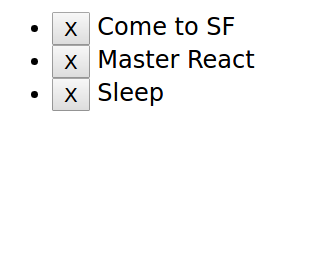
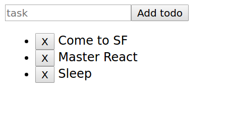
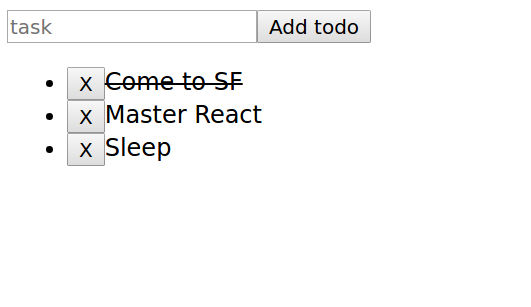

# React Todo App from Scratch

Today you will be building a full-featured React app that lets you add, cross off, and remove tasks from a todo list. You've built a few React apps by now, but the big difference this time is that we aren't providing you with any files to start from. The training wheels are off! We believe in you and will be running alongside you to make sure you don't tip over and skin your knee, so don't worry!

We will also be spending some time to demonstrate some recommended project and code organization as well as best practices.

**READ EVERYTHING, IN ORDER!**

Sections:

1. [Getting Set Up](#part-1-getting-set-up)
2. [Writing a Static Mockup of our React App](#part-2-writing-a-static-mockup-of-our-react-app)
3. [Adding in Functionality with Event Handlers](#part-3-adding-in-functionality-with-event-handlers)
4. [Persistence with MongoDB](#part-4-persistence-with-mongodb)
5. [Bonuses](#part-5-bonuses)

## Part 1: Getting Set Up  

1. For this project, you will create a new Github repo to work on. Make sure to set the appropriate `.gitignore` when you create the repo. Clone down the repo to a place on your comptuer outside of the `bootcamp` folder.

2. Now [follow the directions here](https://github.com/GTBitsOfGood/tech-team/tree/master/boilerplate) to set up the boilerplate for React and Express.

## Part 2: Writing a Static Mockup of our React App

A good place to start the journey ahead is by completing a visuals-only version of our app. We'll identify components and write them statically with dummy data before we add any functionality.

### Seeing Squares

Though we could write everything in a single component, a good React app will be broken up into several modular pieces. Visualize what a basic Todo app with our desired features might look like (even with a pen and paper if you'd like) and draw a box around everything that could reasonably be considered a unique building block for the app. Choosing wisely here can turn one big task into many individually trivial ones, so it's worth spending some time on. After you've given this some thought, compare your findings to the components below that this writeup will be using.

<details>
  <summary>Our Components</summary>

  1. `Todo`:  An individual todo item. The `Todo` boxes we've drawn in the picture in our head will include the task text as well as an X button to delete the `Todo`.
  2. `TodoList`:  The box around the assortment of `Todo`s in our picture.
  3. `InputLine`: A row at the top of our app that has an input field and a submit button. This is how a user will add new `Todo`s.
  4. `TodoApp`: A box around the whole thing. This is what we will pass into `render`, and later we'll choose this as a good place to put some functionality.

  If the boxes you drew differ slightly that's perfectly fine. There's some subjectivity here as to where the line between helpful and unhelpful is when breaking your app up into components. But for the sake of these instructions remaining helpful to you, stick with the breakdown above for today.

</details>

### Let's See the List

We're going to start with the visuals of the list portion of our app.

Now that we're getting into javascript in earnest, let's make a commitment to be consistent with good style. It not just elitism, it is legitimately easier to write a project in clean code than it is to write spaghetti. Throughout this assignment, hold yourself to good style __at all times__! It should **NEVER** be difficult to find a closing curly brace -- if it is you've screwed yourself over by not indenting properly, so STOP and fix it before anything else. Use ES6 features, especially arrow functions, **EVERYWHERE!** There will be several spots in which callback functions and binding could trip you up, so arrow functions are both cleaner AND safer. Cleanliness will save much more time than it costs, honest.

Note: In a real project we would set up `linting` to enforce we met style requirements. One of the highest regarded collections of style rules is [Airbnb's eslint](https://www.npmjs.com/package/eslint-config-airbnb), which requires you to use arrow functions, proper indentation, semicolons, line length limits, naming conventions, `const`/`let` over `var`,  and countless more good practices.

1. The data that we are displaying will eventually be user supplied and maintained in a database, but for this phase we will use dummy data while we get appearances right. Create an array of strings at the top of your file called `dummyData`, where each string sounds like some todo task.

2. Make a component called `TodoList`. Its render method should return an unordered list (`<ul>`) full of `Todo`s. Use `map` to make one `Todo` for each string in `dummyData`, and give each `Todo` the string it corresponds to as a property called `task`.

    Note: This mapping will produce the warning in console we typically have when we don't supply a unique `key` to each item in a JSX array. While this warning is very important, during the static mockup phase, we will not be concerned with this, and we will be able to fix this much more easily in a much later step when our tasks come from a database.

3. Now make the `Todo` component we used in the previous step. Each `Todo` should render an `<li>` that contains the task it was given and an "X" button.

4. Change the `ReactDOM.render` call inside `client/src/index.js` to render a `TodoList`:

  ```javascript
  ReactDOM.render(<TodoList />, document.getElementById('root'));
  ```

Now check out how your app looks in your browser. You should see a bulleted list of the strings you wrote in your `dummyData` and an X button for each one.



This is another good checkpoint to commit. In general, commit at the end of each of these sections if it left off on a stable version of the app.

### Let's See the Rest

There's not much more to add, visually speaking.

1. Make a component called `InputLine` that renders a text input field and a submission button. **Remember that render can only return a single JSX element, so any time you have adjacent ones they'll have to be wrapped in a `<div>`.**

2. Make a component called `TodoApp` that renders an `InputLine` and a `TodoList`. Change the `ReactDOM.render` call to render a `TodoApp`.

    

    We've got every box now (making this a decent checkpoint to commit), but our static app isn't yet fully representative of one with live data. We don't want to end this mockup phase until we are certain the only things the next phase will include are adding event handling attributes (`onClick`, `onChange`, etc.) and replacing `dummyData` with some database call. We're going to add in some sense of tasks being completed or not, and then in the next step we will move some stuff around in anticipation of the following phase.

3. From this point on we're going to assume that `dummyData` represents some response from the database. To that end, replace each string in `dummyData` with an object that looks like this:

      ```javascript
      { taskText: "Catch 'em all", completed: false }
      ```

    Be sure to include both complete and incomplete tasks.

4. Now that the data shape has changed, we'll have to update the way `TodoList` passes information (`props`) to each `Todo`. The `Todo` will still need to know what its task is, but also whether or not that task has been completed.

5. Update `Todo` to display its task as crossed out if it is completed. You won't be able to use an `if` statement inside your JSX, so this is a good time to whip out the Conditional (Ternary) Operator: `condition ? value if true : value if false`. You can display crossed out text by using a `<strike>` tag.



Does everything look right? Commit if so.

### (Optional) Styling with CSS

Now would be a great time to add better visuals to our mockup. The creative flair will be up to you, but here's how you can get your artistry onto the screen.

1. Add a file into your `client/src` folder with some name like `main.css`.

2. Inside any component fily where you want to use the css styles contained in `main.css`, add the line `import "./main.css";` to your import statements.

3. Work your magic by filling in the contents of your css file while editing the JSX returned by your components to include classes, etc. Remember that `class` is a reserved word in javascript, so JSX instead uses the camel-cased `className`.

### Organizing React Code: Presentational/Container Components

Our app should look visually complete now, but before we move on, let's talk about the `Todo` component we've written. Ask yourself: does this component do any 'thinking'? All it seems to do is take the properties it was passed and wrap them in JSX, it doesn't have any state. A component that is explicitly told everything it needs to know through `props` such that it doesn't figure anything out for itself is often referred to as a `presentational component`.

Now it may seem obvious that we would have a bunch of presentational components on our hands after writing a static mockup of our page where we were explicitly avoiding writing any logic or giving components state, but now ask yourself this: when we add interactive functionality to our app, will `Todo` still be a presentational component?

Answer is, it depends: If we wrote a new function `clickToggle` inside `Todo` to be used when the task is clicked, then `Todo` would be responsible for any logic involved in toggling and would no longer be logic agnostic -- it would not be presentational. But, if we passed a function into `Todo` as a prop called `clickToggle` whose logic was written elsewhere, then `Todo` still would be presentational!

Making use of presentational components can help you organize your code by concentrating logic into fewer components. In our app, much of our functionality will involve making use of our database. Rather than have code pertaining to the database across all our components, let's make it so that only `TodoApp` talks to the database, and the other components will be presentationals getting their functionality through properties. This way the roles of each component are clearly divided, many are simplistic, and all our database-related code is in one spot rather than all throughout our code (which will later involve a separate file per component). A component that concentrates logic and disseminates it down to children presentational components through props is called a `container component`.

<details>
<summary>Presentational Components and Functions</summary>
  The way we spoke of presentational components should have made them sound like purely a mapping going from input properties to output JSX. If you are a genius coder you might have found this to be similar to a function, one whose arguments are properties and whose return value is JSX. In fact, another motivation for using presentational components where possible is that there's a really nifty shorthand notation where you actually just write them as a function! Most of the time, only your container components will need constructors, state, or component lifecycle methods.

</details>

1. Recognize that right now `TodoList` is just barely not a presentational component. It references `dummyData` which is a pretend representation of our database that it accessed from the global scope, and 'database access' is considered 'thinking'. We set out to move database access into our `container component` `TodoApp`. Plus, we shouldn't rely on global access in React code anyway since in principle all our components could be in separate files, and also because changes to the global value would not cause rerendering like changes to input props would. So change the use of `dummyData` in `TodoList` to instead use a `prop` passed into `TodoList` called `todos`.

2. In the constructor for `TodoApp`, initialize a state variable `todos` to be an empty array.

3. Have `TodoApp` pass in a `prop` called `todos` to `TodoList` that it reads out of `this.state.todos`.

4. Add a `componentDidMount` function to `TodoApp` that calls `this.setState` to assign a value to `todos`. Soon this value will come from accessing database, but for now simulate accessing the database by accessing `dummyData` from the global scope.

This rearranging of data flow should not have affected the look of your app. What it will do though is make the task of adding functionality more conceptually organized.

Commit.

### Organizing Project Structure

The way we've written and will continue to write our code should now be well-organized and modular enough that we should be able to completely separate each component into its own file.

1. Be sure the top of each component file includes an `import` for `React` and any other component file directly referenced in that component.

2. Be sure the bottom of each component file has `export default COMPONENT_NAME_HERE;`

3. `TodoApp` is the only component who needs access to the database after the last part, so be sure that the `dummyData` lives in `TodoApp` and nowhere else.

4. Your `index.js` should now look pretty bare. Having extracted out the components means you can consider `index.js` a file that just sets up and renders your app.

    ```javascript
      import React from 'react';
      import ReactDOM from 'react-dom';
      import TodoApp from './TodoApp';

      ReactDOM.render(<TodoApp />, document.getElementById('root'));
    ```

Your app should still render in exactly the same way it did before, but now it's significantly harder to get lost in the code than before when you'd be scrolling up and down to find the component you were looking for or work on 2 components at once. Separate files are also incredibly helpful when collaborating using `git`, as it's easier to avoid merge conflicts and track the history of the project's changes.  

Speaking of git, you should commit now.

## Part 3: Adding in Functionality with Event Handlers

All muckings with our 'database' `dummyData` will occur in our container component `TodoApp`, and any presentational that needs to initiate one such mucking will be given one of `TodoApp`'s functions as a property to do so.

### Adding Todos

1. Add a class method to `TodoApp` called `addTodo`. This method should:

    1. Take in a string task as an argument.

    2. Add the passed in task into `dummyData` (remember to set `completed` to `false`).

    3. Call `this.setState` to update `todos` to be the latest version of `dummyData`.

2. Give `addTodo` to `TodoApp`'s child `InputLine` as a prop called `onSubmit`.

    Notice that `addTodo` uses `this` in its body. This means that whenever we pass it around we will have to worry about binding. __That is unless we use arrow functions.__ So whenever we go to pass a function `this.addTodo` as a prop to anything else we will never run in to any issues if we instead pass the function `() => this.addTodo()`. This is your final warning, do this everywhere or suffer.

3. In `InputLine`, add an `onClick` handler to the button that calls the `onSubmit` function that `InputLine` received as a `prop` with the argument `"Test Task"`. Double check that what you've given `onClick` is actually a function.

Test out your new button and see that your task list grows. Sweet.

Do you smell that? It smells like *commit*.

### Inputting Todos

Adding the same task every time is useless and boring. We would like to add a task with the text in the input field. If the input field were where the `onClick` handler was, its text would be retrievable from an event passed into the handler via `event.target.value`. But in this case, we want to use the input field's text when clicking a separate button. To square this circle we will track the current text of the input field in a state variable `typedText` which will be accessible in the click handler of the button. This is a pattern you will use often when making input components, and it was the subject of the React Forms videos. This section only amounts to the code demonstrated in those videos, so if you're having trouble you should return to them.

Note: One could argue that the code we're adding in this step isn't really new functionality but rather a detail intrinsic to an input field; The details of `InputLine`'s internal state tracking don't affect our app outside of `InputLine` in any way. So despite this component having a state and more functions than just `render` at the end of this step one might still be able to defend it as a presentational component.

1. In `InputLine`'s constructor, initialize a state variable `typedText` to be an empty string.

2. Add a class method to `InputLine` called `handleTyping` that takes an argument `event` and calls `this.setState` to set `typedText` to be `event.target.value`.

3. Add `handleTyping` as an `onChange` event handler to the input field. Remember that the argument `event` is supplied automatically for event handlers. The arrow function way of doing this is `onChange={(event) => this.handleTyping(event)}`.

4. Add a `value` attribute to the input field to manually assign the text field the value saved in the state variable `typedText`.

    After these steps, we will always have whatever has been typed in the input field available as `this.state.typedText`. Now let's use it when clicking the button.

5. Make another new class method in `InputLine` called `handleSubmit`. This function should:

    1. Call the `onSubmit` function passed into `InputLine` as a `prop` with the current `typedText` as its argument.

    2. Call `setState` to reset `typedText` to the empty string.

6. Change the `onClick` handler on the button in `InputLine` to use the `handleSubmit` function we just wrote.

Try out your app and ascertain that you can type and add new Todos to your list.

Look, up in the sky, it's Halley's *commit*.

### Removing Todos

1. Add a new class method into `TodoApp` called `removeTodo` that takes an argument `index`. This function should be analogous to `addTodo`, but instead of adding a task it should remove the one at the specified array index.

2. Pass this new function as a property called `todoXClick` to `TodoList` in `TodoApp`'s render method.

3. In `TodoList`'s render', give each rendered `Todo` a property `xClick` that is an arrow function that calls `todoXClick` with the index corresponding to that `Todo` as its argument. That pattern looks like `() => this.props.todoXClick(index)`.

4. In `Todo`'s render method, add an `onClick` to the button that calls the passed in `xClick`.

Now try out deleting Todos in your app. Come up with some basic edge cases and test those out before *committing*.

### Toggling Todos

Now that you've seen the pattern laid out in the Adding Todos and Removing Todos sections, try making toggling happen completely on your own.

1. Implement toggling. Refer to the previous sections for inspiration if you must.

After that's complete, we have a fully working Todo List React App! It may have seemed like an inordinate amount of steps to get something so simple, but that's only because we're over-engineering a bit for the sake of practice and we took our sweet time to talk over every detail. Hopefully adding the toggling yourself demonstrated that the next time you give this a whirl you could whip it up pretty quickly.

You should commit here.

## Part 4: Persistence with MongoDB

Now we want to use mongoose to interact with a live MongoDB database hosted on mLab, but there's a snag. React code is frontend code. But mongoose cannot run in the browser, only in Node.

What we have to do is have an intermediary server. The frontend has to ask a node backend to use mongoose on its behalf. Our app will make requests of a server we will write, and the the endpoints/routes handling those requests will use mongoose and respond with the latest data.

### Setting up an Organized Server

1. At the beginning of this tutorial, you already went ahead and set up your backend boilerplate using the express generator. Now we'll dive into the `/server` directory to write our backend code.
2. Inside the `/server/routes` directory, create a new file called `todos.js` that looks like this for now:

    ```javascript
    const express = require('express');
    const router = express.Router();

    router.get('/add', (req, res) => {
      res.send('Hello');
    });

    module.exports = router;
    ```

    This thing we've named `router` you can treat a lot like you treat your express `app` -- you can add `.get`s, `.post`s, etc. exactly the way you are used to. The conceptual difference is that `router` will serve as a subapp so to speak. Were our app to grow, we could put all the routes related to the `todos` in `todos.js` (`/todos/add`, `/todos/toggle`, ...), all our routes for signup/login in an `authorization.js` (`/auth/signin`, `/auth/signout`, ...), etc.

3. Now add these 2 lines to `server/app.js`, the first up with the `import`s and the second under the `app.use('/', indexRouter);` line.

    ```javascript
    const todosRouter = require('./routes/todos');
    ...
    app.use('/todos', todosRouter);
    ```

    This is setting up a pattern that will allow us to use routes in this file that are written in a separate one, to continue with clean code organization. A real app may have countless routes, so it's preferred not to have them all written in one massive file.

Commit.

### Connecting the Server to MongoDB

1. Make a new folder `models` in the `backend` folder and put a `TodoItem.js` inside that looks like this. __Don't forget to install mongoose first.__

    ```javascript
    const mongoose = require('mongoose');

    const todoItemSchema = new mongoose.Schema({
      task: { type: String, required: true },
      completed: { type: Boolean, default: false }
    });

    const TodoItem = mongoose.model('Todo', todoItemSchema);

    module.exports = TodoItem;
    ```

2. Before we can use this mongoose model with our database, we have to connect to one.
    1. Register a new database and user on Mongo Atlas the way we've done before. You can also choose to use the same database information from any of your previous exercises.
    2. Put the URI in an `.env` at the root of your directory, use a tool like `dotenv` to help you source your environment variables.

         - We don't want to push our `.env` to github, because it contains private information. Open `.gitignore` and scroll to the very bottom. You can see here that the `.gitignore` is mentioning environment already. Github was smart enough to predict this in generating our `.gitignore` for us.

    3. Make a `mongoose.connect` call under the `import`s in `server/app.js` to actually connect to the database using the URI in our environment. You may need an install/import.

3. `import` the `TodoItem` model in `server/routes/todos.js` and replace the existing route's contents with:

    ```javascript
      const testTodo = new TodoItem({
        task: "test task"
      });

      testTodo.save()
        .then(response => {
          res.send(response);
        })
        .catch(error => {
          res.send(error);
        })
      });
    ```

  So when the client makes a get request to `localhost:3001/todos/add`, it should arrive at this endpoint. This endpoint makes a TodoItem and saves it to our remote MongoDB (this is itself a request to a server owned by Mongo!). When that operation is completed/failed, we end up in the `then`/`catch`, which will respond to the client who sent the original request using whatever response mLab provided.

  See what happens when you visit `localhost:3001/db/add` in your browser now. You should see a JSON response indicating that the todo was stored successfully. Head over to Atlas to see that it is in fact there!

  Keep committing.

### A Complete Request Flight: Client->Server->Atlas->Server-> Client

Now let's make this test endpoint use real data from the app, and have the app react to the response it gets.

We are going to need to make a request from the client. Just like you did in the React w/API exericses, we will use `Axios` to make HTTP requests.

1. Today we'll choose `axios`. Install it like any other npm package. Make sure to navigate to your `/client` directory before you try to install `axios`

2. `import` `axios` in your `TodoApp` component. Remember that `TodoApp` is the only one that cares about the database, so it will be the only one communicating with the routes we wrote specifically to interface with the database.

3. Define a variable above the component:

    ```javascript
    const apiUrl = "http://localhost:3001/todos";
    ```

    This is better practice than writing this url multiple times because if we ever change the url or port we don't want to hunt down all the places we used it and change all of them. We'll write the `/todos/add` route as `apiUrl + '/add'`.

4. We'd rather use a post request than a get request to submit information about the todo to be added to our server, we only wrote a get before to test things out. You can write a post request in axios like:

    ```javascript
    axios.post(/*URL_HERE*/, /*POST_BODY_HERE*/)
      .then(function (response) {
        // Do whatever you want with the request's response in here
      })
      .catch(function (error) {
        // Do whatever you want in the event of an error in here
      });
    ```

    Slap this into `TodoApp`'s `addTodo` and fill in the blanks. In the `then` and `catch` you can just `console.log` `response` and `error` respectively. The server will only need the task text from the post body. You can comment out everything that was in `addTodo` before.


5. Now go to `server/routes/todos.js` and change the `GET` route to a `POST`. Also replace the `test task` with the text that came in with the `POST` request (i.e `req.body...`).

    Go ahead and run the app. When you type into the input field and click the submit button, you should see a success log in your console. Take a look at Atlas to be sure an entry got added and that it has the correct task and `completed` as false.

6. Now finish the cycle by going into the `.then` in `TodoApp` where your `console.log` currently is and replace the console log with:

    ```javascript
    this.setState({ todos: this.state.todos.concat(response.data)});
    ```

    This will add the todo you just found out was successfully added to the database (it's found in `response.data`) into your locally tracked `this.state.todos`. We use `concat` and not `push` because we always treat state variables as immutable and need the array reference to change.

When you add an item now, it should end up in Atlas and also on your screen! Of course, things aren't quite right because we are half using `dummyData` and half using real data. Let's change that.

But first, commit.

### No Dummies Here!

Our code must be pure.

1. Erase the lines in `TodoApp` where `dummyData` is defined. This will signal to its brethren that the culling is upon them. They have plagued our app with their filth long enough and must be eliminated.

2. In the constructor, initialize `todos` to be an empty array, vanquishing the `dummyData` that previously resided there.

3. Add a `componentDidMount` that uses `axios` to make a get request to `apiUrl + '/all'`. In the `.then` it should `this.setState` `todos` to be `data.response`. When we write it, gets to the `/todos/all` route will receive all items in the database as a response, so this step loads the existing data when the app first starts.

4. Now that `this.state.todos` is live data, we can easily take care of the `key` warning in console by using the unique ids given to each todo by MongoDB. In `TodoList`'s render, supply each rendered `Todo` a property `key={todo.id}`. This will enable React to differentiate the adjacent `Todo` tags and better optimize. We could have accomplished this even without id's from MongoDB by adding unique id's to todo items ourselves, say be counting up from `0` or using an id generating package like [uuid](https://www.npmjs.com/package/uuid).

5. Move on to `toggleTodo` and obliterate the `dummyData` found there along with any neighbors in the same spot it may have loved. Atop their graves, use `axios` to make a `POST` request to `/todos/toggle`. You should change the argument of `toggleTodo` from `index` to `id`, since we will be switching from using array indices to using mongo's id's. The `axios` POST body will only need to include the passed in `id`. In the `.then`, you need to write code that will `this.setState` `todos` to be a new array with all the same contents but with the toggled object replaced with the one given back as `response`.

6. We already visited `addTodo` before, but there might be a lowly `dummyData` taking shelter in a comment from when we were last here. Unacceptable. End it.

7. Lastly, go to `removeTodo` and crush the final vestiges of `dummyData` et al. you find there beneath the awesome might of your backspace key. Celebrate your murderous feat with an `axios` POST request to `/todos/remove`. Change `index` in this code to `id` just like before, include it in the post body, and write code in the `.then` that will make `this.state.todos` a new array containing all the same elements minus the one just deleted (without mutating).

We'll have to write our routes before we can see this in action, but take one quick perusal to be sure the code looks right and that we are rid of the `dummyData` scourge in favor of live data.

We've just *committed* murder together.

### Handling Mongeese

Allowing a moment for the crimson haze to dissipate from your vision as you come down from the high of your bloodlust, get your bearings as to what exactly remains to be done in  `/server/routes/todos.js`. We've just written the client's portion of several database interactions, and now we'll have to accept those requests on the server and access MongoDB via mongoose before responding -- just as we did with `/todos/add`.

1. You should be seasoned enough to implement working routes for each of `/todos/all`, `/todos/remove`, and `/todos/toggle` without further guidance. It is recommended that you pick one and find a good way to be certain that the cycle from client interaction to server to Atlas and back for that action in isolation is fully working before moving on to others.

------------------------------

Have you gotten the app fully working? If so, some serious congratulations are in order! Guidance aside, this was done from scratch. There was absolutely nothing here before, no skeleton, no tests, no nothing, and now there is an immaculately written webapp. If you followed the motivation of each of the steps laid out here and not just the letter then you can be assured that you will be capable of creating your own projects yet even in absence of this program's guiding hand.

As you should do from time to time, take stock of your capabilities now compared to 2 months ago and be proud of the immense achievements you've made in such short time.

Don't forget to `git push` your commits so that your app is saved forever where anyone can see it.

## Part 5: Bonuses

Try your hand at any or all of these bonus features that seem interesting to you.

1. Add styling to make it gorgeous, if you didn't do that earlier.

2. Add a footer to the app that lets you select a filter for which Todos to display: All, Completed, or Incomplete.

3. Add a footer (or build on your existing one) that has a text field you can type in to filter for tasks containing the input text.

4. Make a task toggle on double click rather than single click.

5. Make the Todo List rearrangeable with drag and drop.

6. Come up with an app idea as simple as a todo list and see if you can build it out from an empty directory even in absence of the guidance from this exercise. Perhaps over the weekend.
