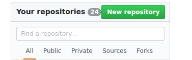
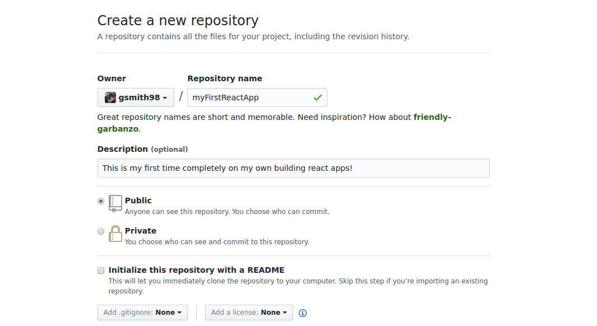
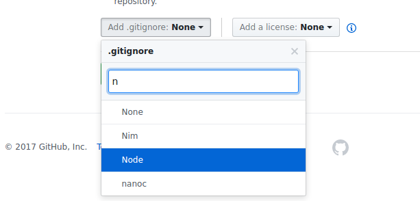
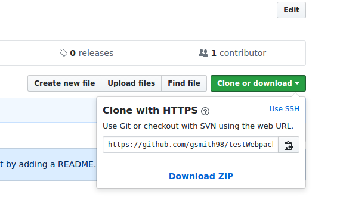
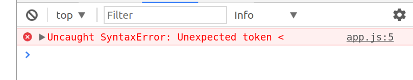

# React Todo App from Scratch

Today you will be building a full-featured React app that lets you add, cross off, and remove tasks from a todo list. You've built a few React apps by now, but the big difference this time is that we aren't providing you with any files to start from. The training wheels are off! We believe in you and will be running alongside you to make sure you don't tip over and skin your knee, so don't worry!

We will also be spending some time to demonstrate some recommended project and code organization as well as best practices.

**READ EVERYTHING, IN ORDER!**

Sections:
1. [Getting Set Up](#part-1-getting-set-up)

1. [Writing a Static Mockup of our React App](#part-2-writing-a-static-mockup-of-our-react-app)

1. [Adding in Functionality with Event Handlers](#part-3-adding-in-functionality-with-event-handlers)

1. [Persistence with MongoDB](#part-4-persistence-with-mongodb)

1. [Bonuses](#part-5-bonuses)

## Part 1: Getting Set Up  

Why don't we start by going from nothing to something? We'll walk you through how you can turn your empty directory into a comfortable coding environment.

### Baby Steps

1. Always start with version control. Let's get our git tracking and remote repository set up. Your building this exercise from scratch, so you will be making your own repository on github rather than making a branch on one of ours. Gotta bolster that profile for potential recruiters.

    1. Visit `github.com` and log in. You should see a button to create a new repository somewhere on the right hand side. 
      
        

    1. Fill out the page to give your repository a name and description. 
    
        

    1. Click the dropdown to add a `.gitignore` to your project. This will automatically generate a `.gitignore` file appropriate for a typical project of the given type, in our case `Node`.  
    
        
        
        The `.gitignore` file tells git which files it shouldn't bother tracking or pushing, either because it's unnecessary (like packages/dependencies) or straight up dangerous (like env files containing secret credentials). Any cred you accrue from having a cool React app on your profile could be thrown out the window if people see you pushed your entire `node_modules` directory like a goober.

    1. Submit the form to be given a fresh github repo. Neat. To get it onto your machine, navigate to your `horizons` folder and `git clone YOUR_CLONE_URL_HERE`. You can find the url to clone from on the right hand side of the page. 
    
        

    1. You should now have a directory with the same name as your online repository. The two will be linked so that when you `git push` it will push to your online repo, etc. `cd` into this directory, and perhaps open it in an editor like atom, before continuing.

1. Turn your directory into an npm project.

    ```bash
    npm init
    ```

    It will ask you a lot of questions about your project. These fields don't matter much unless you're publishing on `npm` or doing something serious, so you can just hit enter through the prompts. However, it may insist that you type a project name with no capitals if your repo/directory name has capital letters.

1. Our cool app has gotta have some javascript. For now, let's just make a very simple `app.js` until we're convinced we've got everything up and running. An alert will be a good test.

    ```javascript
    alert('app.js ran!');
    ```

1. Now, our little javascript file isn't going to be able to run in the the browser all by it's lonesome; It will need to be brought in by an HTML `<script>` tag. We were of course going to need an HTML file anyway, since when we go to render a React component we'll need a `<div>` tag with id `root` to attach it to. We may as well do both of these things while making an `index.html` now.

    ```html
      <!DOCTYPE html>
      <html>
        <head>
          <title>Horizons Todo</title>
        </head>
        <body>
          <div id='root'></div>
          <script type="text/javascript" src="app.js"></script>
        </body>
      </html>
    ```
Now try opening this `index.html` in your browser to see a glorious browser alert. We've reached a point where we can run our javascript! So we can just get started making our React app for real now since that's all we really needed... right?

### It's React Time!

Our objective now will be to render a simple `<p>` tag with React before moving on to making components. It's always a good idea to start with something minimal and work your way up in small pieces to ascertain that everything is working incrementally.

1. We can't build a React app without installing React!

    ```bash
    npm install --save react react-dom
    ```

1. We can ditch the `alert` in `app.js` and pull in the dependencies we just installed.

    ```javascript
    var React = require('react');
    var ReactDOM = require('react-dom');
    ```

1. Lastly, let's render a tag and take our app for a test spin!

    ```javascript
    ReactDOM.render(<p>React lives!</p>,
       document.getElementById('root'));
    ```

Let's see that `<p>` tag render in all it's glory by opening `index.html` in a browser again.



Huh?

### Psyche, We OverReacted

Why are we getting this error? This is the same code we've always written when using React, and our app worked before when we checked to see that we could run javascript with the `alert`. But that's just it: **The code we use when writing React is NOT javascript!** When javascript sees the `<` in `<p>`, it thinks it means "less than" which doesn't make sense there. What we wrote isn't valid javascript at all, it's JSX! The browser natively understands javascript, but it can't be made to understand JSX.

Note: The situation is actually worse than this. The browser does not understand `require` either, that's a Node thing! Furthermore, the `class Todo extends React.Component` line that we will need to use when making React Components is actually ES6 syntax, which browsers don't always fully support.

The solution to our woes is not to get the browser to behave differently, that's not within our power. What we need to do instead is change our code into different code that does the same thing using only javascript the browser is cool with. Although the browser can't deal with `<p>Hi</p>`, it's completely fine with `React.createElement('p', null, 'Hi')`. __Anything that we can write in code the browser doesn't understand can also be written exclusively in code that it does.__

"That `createElement` crap again?", you cry. "But we ditched that cuz it was hella obnoxious!" Well, you'll be happy to hear that you never actually need to directly write the gross code the browser wants. We can get the code you've already written to work just fine with a little more setup.

### Setting Up Webpack

Enter webpack. Webpack is a tool commonly used among web developers to manage build tasks, i.e. steps needed to bundle up the shippable app. At the moment, we are interested in a build task that will translate - or `transpile` - the code we've written into a version of javascript that the browser speaks, so that we can write the way we want. So we will be configuring webpack to use a tool written specifically for this task: Babel.

Note: Babel could be run on it's own without webpack, but as a real app grows to need more build tasks and tools for those build tasks we would rather have a manager like webpack keep track of all that for us.

1. Before we continue, let's first move our files around a bit. Right now we have:

    ```bash
    ├── node_modules
    │   └── ...
    ├── app.js
    ├── index.html
    └── package.json
    ```

    Let's reorganize slightly to:

    ```bash
    ├── node_modules
    │   └── ...
    ├── build
    │   └── index.html
    ├── reactApp
    │   └── app.js
    └── package.json
    ```

    For now we've just moved `index.html` into a `build` folder and moved `app.js` into a `reactApp` folder. This organization wasn't really needed yet, but it's good to be proactive.

1. Here come a lot of dependencies:

    ```bash
      npm install --save webpack@2 babel-core babel-loader babel-preset-react babel-preset-es2015
    ```

    We're grabbing webpack and a number of Babel related packages. `babel-preset-react` is the piece that enables us to transpile JSX into `createElement` calls, and `babel-preset-es2015` handles ES6.

    Note: The `@` symbol indicates that we are grabbing specifically webpack version 2. Webpack 3 released officially on June 19, 2017 and has significantly improved its performance and capabilities. However, with major improvements must come major changes, and other packages that interact with webpack haven't yet had time to adjust accordingly at time of writing. Furthermore, something so new is bound to have some undetected kinks, and an issue caused by something in webpack's internal code is the **last** thing you want to bug hunt. For these reasons, early adoption of a technology in your codebase is considered risky and developers are generally reluctant to upgrade. One TA in testing out this exercise in mid June did in fact encounter build errors as a result of version 3's release, so we would like to be certain that all students are working with webpack 2 to be assured that everything runs smoothly.

1. Next up is writing the webpack configuration file, `webpack.config.js`. Configuring webpack can be finnicky, but it's a rite of passage for young web developers. If you want, we can do this one together, and then in future projects you'll be able to reference - or even copy - the config file we end up with here. Or, if you'd rather, you can forgo this optional walkthrough and skip to the end to copy a working `webpack.config.js` (which is actually what a developer would typically do when starting a new project, so there's no shame).

    <details>
      <summary>Teach me to fish. (Make webpack.config.js line by line)</summary>

      You've made a respectable choice. Understanding webpack a little better could save you from wrestling with it later when your project has more requirements.

      Note: Since webpack will be responsible for translating the ES6 in our app, we won't be using any of it in this file. It is possible to do so with some extra configuration, but it's not particularly important so we'll skip the additional hassle.

      1. Start by creating a file named `webpack.config.js` in the root of your directory and put this inside:

          ```javascript
          var webpack = require('webpack');

          module.exports = {

          };
          ```

          The empty object currently being exported is a webpack config object which we're going to fill in one field at a time together.

      1. In the export of `webpack.config.js`, add a key called `entry`. This specifies the string path to the file containing our app.

          ```javascript
          module.exports = {
            entry: './reactApp/app.js',
            ...
          ```

      1. Next add a key `output` which will hold an object containing keys `path` and `filename`. The `filename` will be the name of the file output by the build, and the `path` is the absolute path to where that file should go. Since the path must be absolute, `__dirname` comes in handy here. (Note: It's good practice to use the `path` package here to resolve file paths. But for the sake of keeping things as simple as possible, the code below just uses string concatenation.)

          ```javascript
            ...
            output: {
              path: __dirname + '/build',
              filename: 'app.bundle.js'
            },
            ...
          ```

      1. Next comes a more involved key called `module`. Ours will have one subkey called `rules`, which is an array of objects representing rules to follow at build time.

          ```javascript
          ...
          module: {
            rules: [
              ...
            ]
          },
          ...
          ```

          We're going to have a single rule that says to run Babel on all files ending in `.js` (excluding any in the `node_modules` folder) to translate ES6 and JSX.

          ```javascript
            {
              test: /\.js$/,
              exclude: /node_modules/,
              use: {
                loader: 'babel-loader',
                options: {
                  presets: ['es2015', 'react']
                }
              }
            }
          ```

      1. Lastly, we'll add two keys that are purely nice-to-have's. We're making webpack's output colorful by means of the `stats` key, and we're turning on the sourcemapping so the line numbers of the input and output files match exactly (which is a great help for debugging during development). (Sometimes steps need to be taken in Chrome to enable sourcemapping. If you encounter this issue you can call over a TA or move on without it.)

          ```javascript
            ...
            stats: {
              colors: true
            },
            devtool: 'source-map'
          };
          ```

    </details>
    <br>
    <details>
      <summary>Just gimme dat fish. (Skip to a finished webpack.config.js)</summary>

      Your `webpack.config.js` should be on the root of your directory and should look like this:

      ```javascript
      var webpack = require('webpack');

      module.exports = {
        entry: './reactApp/app.js',
        output: {
          path: __dirname + '/build',
          filename: 'app.bundle.js'
        },
        module: {
          rules: [
            {
              test: /\.js$/,
              exclude: /node_modules/,
              use: {
                loader: 'babel-loader',
                options: {
                  presets: ['es2015', 'react']
                }
              }
            }
          ]
        },
        stats: {
          colors: true
        },
        devtool: 'source-map'
      };
      ```
    </details>

      With this configuration, running webpack (which we'll do shortly) will translate your `app.js` and put the result in `/build/app.bundle.js`.

1. With the webpack config done, we're about ready to run a build. But before we can, we need a way to actually start one. Add a script into your `package.json` called `"webpack"` which simply runs the command `"webpack"`. Remember that `package.json` scripts are comma separated and look like `"scriptname": "command to run"`.

1. The last thing we need to do is change the `<script>` tag in `index.html`. At the moment, it will still try to use the `app.js` file we've written (which we've actually moved), but we need it to use the translated version that will be spat out by webpack. Do you remember where that file will be in relation to `index.html` and what it will be called? The appropriate change should be `src="./app.bundle.js"`.

1. That was everything webpack should need, but just to prove to ourselves that it is translating both JSX and ES6, let's first change the `require`s in `app.js` to be `import`s. Remember, `var thing = require('package');` becomes `import thing from 'package';`.

Now let's see if we set everything up correctly. Run your webpack script with `npm run webpack` and cross your fingers while it runs. If anything went wrong, compare your `webpack.config.js` to the one provided above and make sure you got all the syntax right.

If you're seeing success messages and a bunch of green on your screen, congratulations! You've just built your first project with webpack! You'll notice that the `build` folder now has the output file `app.bundle.js` (the `.map` file is there because we turned on sourcemapping in `webpack.config.js`). Open `index.html` in your browser to see that we've finally made it! Phewf, that was a lot of setup work just to use React.

### The Webpack Dev Server

You may be itching to be done with setup so you can get to the coding already, but while we're still in the weeds there's one more thing we can do for a payoff you might appreciate.

1. Install this dev dependency:

    ```bash
    npm install --save-dev webpack-dev-server
    ```

1. Add a script to `package.json` called `dev` that runs:

    ```bash
    webpack-dev-server --content-base build/
    ```

Go ahead and take that new script for a spin. You'll notice that webpack appears to build like before, but this time the program does not terminate. If you were watching the output, you may have seen this in there

>**Note:** You can run a custom script (defined in your package.json) by running `npm run namehere`

```bash
Project is running at http://localhost:8080/
webpack output is served from /
```

That's right; As the name suggests, webpack-dev-server is is now serving our build off `localhost` without us having written an Express server or anything! You can go to `localhost:8080` in your browser to see for yourself. But that's not even the best part.

Without closing the browser tab that has your app on it or interfering with the terminal running the webpack-dev-server, change the `<p>` tag in your `app.js` to say something else. Do this with your editor and your browser both in clear sight if your workstation allows. Save the change and take your hands off the keyboard.

Your new message just appeared automatically! This is what makes the webpack-dev-server a fantastic development tool. While you're working on your app, webpack will be building automatically and hot reloading your browser so your grind need never slow.

## Part 2: Writing a Static Mockup of our React App

Now that we've got a good coding environment set up, we can finally get to the React part. Before doing so, though, you may want to save a copy of the directory as it exists right now. That way you can just start from here next time. Copying a preexisting webpack configuration isn't cheating, it's the norm; There's no reason a savvy developer would need to repeatedly reinvent the wheel. It is also recommended that you commit at any good checkpoint such as this, and that you approach a project in a way that affords you reasonable checkpoints.

A good place to start the journey ahead is by completing a visuals-only version of our app. We'll identify components and write them statically with dummy data before we add any functionality.

### Seeing Squares

Though we could write everything in a single component, a good React app will be broken up into several modular pieces. Visualize what a basic Todo app with our desired features might look like (even with a pen and paper if you'd like) and draw a box around everything that could reasonably be considered a unique building block for the app. Choosing wisely here can turn one big task into many individually trivial ones, so it's worth spending some time on. After you've given this some thought, compare your findings to the components below that this writeup will be using.

<details>
  <summary>Our Components</summary>

  1. `Todo`:  An individual todo item. The `Todo` boxes we've drawn in the picture in our head will include the task text as well as an X button to delete the `Todo`.
  1. `TodoList`:  The box around the assortment of `Todo`s in our picture.
  1. `InputLine`: A row at the top of our app that has an input field and a submit button. This is how a user will add new `Todo`s.
  1. `TodoApp`: A box around the whole thing. This is what we will pass into `render`, and later we'll choose this as a good place to put some functionality.

  If the boxes you drew differ slightly that's perfectly fine. There's some subjectivity here as to where the line between helpful and unhelpful is when breaking your app up into components. But for the sake of these instructions remaining helpful to you, stick with the breakdown above for today.

</details>

### Let's See the List

We're going to start with the visuals of the list portion of our app.

Now that we're getting into javascript in earnest, let's make a commitment to be consistent with good style. It not just elitism, it is legitimately easier to write a project in clean code than it is to write spaghetti. Throughout this assignment, hold yourself to good style __at all times__! It should **NEVER** be difficult to find a closing curly brace -- if it is you've screwed yourself over by not indenting properly, so STOP and fix it before anything else. Use ES6 features, especially arrow functions, **EVERYWHERE!** There will be several spots in which callback functions and binding could trip you up, so arrow functions are both cleaner AND safer. Cleanliness will save much more time than it costs, honest.

Note: In a real project we would set up `linting` to enforce we met style requirements. One of the highest regarded collections of style rules is [Airbnb's eslint](https://www.npmjs.com/package/eslint-config-airbnb), which requires you to use arrow functions, proper indentation, semicolons, line length limits, naming conventions, `const`/`let` over `var`,  and countless more good practices.

1. The data that we are displaying will eventually be user supplied and maintained in a database, but for this phase we will use dummy data while we get appearances right. Create an array of strings at the top of your file called `dummyData`, where each string sounds like some todo task.

1. Make a component called `TodoList`. Its render method should return an unordered list (`<ul>`) full of `Todo`s. Use `map` to make one `Todo` for each string in `dummyData`, and give each `Todo` the string it corresponds to as a property called `task`.

    Note: This mapping will produce the warning in console we typically have when we don't supply a unique `key` to each item in a JSX array. While this warning is very important, during the static mockup phase, we will not be concerned with this, and we will be able to fix this much more easily in a much later step when our tasks come from a database.

1. Now make the `Todo` component we used in the previous step. Each `Todo` should render an `<li>` that contains the task it was given and an X button.

1. Change the `ReactDOM.render` call to render a `TodoList`:

  ```javascript
  ReactDOM.render(<TodoList />, document.getElementById('root'));
  ```

Now check out how your app looks in your browser. You should see a bulleted list of the strings you wrote in your `dummyData` and an X button for each one.


This is another good checkpoint to commit. In general, commit at the end of each of these sections if it left off on a stable version of the app.

### Let's See the Rest

There's not much more to add, visually speaking.

1. Make a component called `InputLine` that renders a text input field and a submission button. **Remember that render can only return a single JSX element, so any time you have adjacent ones they'll have to be wrapped in a `<div>`.**

1. Make a component called `TodoApp` that renders an `InputLine` and a `TodoList`. Change the `ReactDOM.render` call to render a `TodoApp`.


We've got every box now (making this a decent checkpoint to commit), but our static app isn't yet fully representative of one with live data. We don't want to end this mockup phase until we are certain the only things the next phase will include are adding event handling attributes (`onClick`, `onChange`, etc.) and replacing `dummyData` with some database call. We're going to add in some sense of tasks being completed or not, and then in the next step we will move some stuff around in anticipation of the following phase.

1. From this point on we're going to assume that `dummyData` represents some response from the database. To that end, replace each string in `dummyData` with an object that looks like this:

  ```javascript
  { taskText: "Catch 'em all", completed: false }
  ```
Be sure to include both complete and incomplete tasks.

1. Now that the data shape has changed, we'll have to update the way `TodoList` passes information (props) to each `Todo`. The `Todo` will still need to know what its task is, but also whether or not that task has been completed.

1. Update `Todo` to display its task as crossed out if it is completed. You won't be able to use an `if` statement inside your JSX, so this is a good time to whip out the Conditional (Ternary) Operator: `condition ? value if true : value if false`. You can display crossed out text by using a `<strike>` tag.


Does everything look right? Commit if so.

### (Optional) Styling with CSS

Now would be a great time to add better visuals to our mockup. The creative flair will be up to you, but here's how you can get your artistry onto the screen.

1. Add a file into your build folder with some name like `main.css`.

1. Add and `link` tag to `index.html` to import your stylesheet.

1. Work your magic by filling in the contents of your css file while editing the JSX returned by your components to include classes, etc. Remember that `class` is a reserved word in javascript, so JSX instead uses the camel-cased `className`.

### Organizing React Code: Presentational/Container Components

Our app should look visually complete now, but before we move on, let's talk about the `Todo` component we've written. Ask yourself: does this component do any 'thinking'? All it seems to do is take the properties it was passed and wrap them in JSX, it doesn't have any state. A component that is explicitly told everything it needs to know through properties such that it doesn't figure anything out for itself is often referred to as a `presentational component`.

Now it may seem obvious that we would have a bunch of presentational components on our hands after writing a static mockup of our page where we were explicitly avoiding writing any logic or giving components state, but now ask yourself this: when we add interactive functionality to our app, will `Todo` still be a presentational component?

Answer is, it depends: If we wrote a new function `clickToggle` inside `Todo` to be used when the task is clicked, then `Todo` would be responsible for any logic involved in toggling and would no longer be logic agnostic -- it would not be presentational. But, if we passed a function into `Todo` as a prop called `clickToggle` whose logic was written elsewhere, then `Todo` still would be presentational!

Making use of presentational components can help you organize your code by concentrating logic into fewer components. In our app, much of our functionality will involve making use of our database. Rather than have code pertaining to the database across all our components, let's make it so that only `TodoApp` talks to the database, and the other components will be presentationals getting their functionality through properties. This way the roles of each component are clearly divided, many are simplistic, and all our database-related code is in one spot rather than all throughout our code (which will later involve a separate file per component). A component that concentrates logic and disseminates it down to children presentational components through props is called a `container component`.

<details>
<summary>Presentational Components and Functions</summary>
  The way we spoke of presentational components should have made them sound like purely a mapping going from input properties to output JSX. If you are a genius coder you might have found this to be similar to a function, one whose arguments are properties and whose return value is JSX. In fact, another motivation for using presentational components where possible is that there's a really nifty shorthand notation where you actually just write them as a function! Most of the time, only your container components will need constructors, state, or component lifecycle methods.

</details>

1. Recognize that right now `TodoList` is just barely not a presentational component. It references `dummyData` which is a pretend representation of our database that it accessed from the global scope, and 'database access' is considered 'thinking'. We set out to move database access into our `container component` `TodoApp`. Plus, we shouldn't rely on global access in React code anyway since in principle all our components could be in separate files, and also because changes to the global value would not cause rerendering like changes to input props would. So change the use of `dummyData` in `TodoList` to instead use a prop passed into `TodoList` called `todos`.

1. In the constructor for `TodoApp`, initialize a state variable `todos` to be an empty array.

1. Have `TodoApp` pass in a property `todos` to `TodoList` that it reads out of `this.state.todos`.

1. Add a `componentDidMount` function to `TodoApp` that calls `this.setState` to assign a value to `todos`. Soon this value will come from accessing database, but for now simulate accessing the database by accessing `dummyData` from the global scope.

This rearranging of data flow should not have affected the look of your app. What it will do though is make the task of adding functionality more conceptually organized.

Commit.

### Organizing Project Structure

The way we've written and will continue to write our code should now be well-organized and modular enough that we should be able to completely separate each component into its own file.

1. Split off your components into files until your directories looks like this:

    ```bash
    ├── build
    │   ├── index.html
    │   └── ...
    ├── node_modules
    │   └── ...
    ├── reactApp
    │   ├── components
    │   │   ├── InputLine.js
    │   │   ├── Todo.js
    │   │   ├── TodoApp.js
    │   │   └── TodoList.js
    │   └── app.js
    ├── package.json
    └── webpack.config.js
    ```

      1. Be sure the top of each component file includes an `import` for `React` and any other component file directly referenced in that component.

      1. Be sure the bottom of each component file has `export default COMPONENT_NAME_HERE;`

      1. `TodoApp` is the only component who needs access to the database after the last part, so be sure that the `dummyData` lives in `TodoApp` and nowhere else.

      1. Your `app.js` should now look pretty bare. Having extracted out the components means you can consider `app.js` a file that just sets up and renders your app, similar to how you main `server.js` file in past weeks just set up and started your server after you extracted the routes out into different files.

          ```javascript
            import React from 'react';
            import ReactDOM from 'react-dom';
            import TodoApp from './components/TodoApp';

            ReactDOM.render(<TodoApp />, document.getElementById('root'));
          ```

Your app should still render in exactly the same way it did before, but now it's significantly harder to get lost in the code than before when you'd be scrolling up and down to find the component you were looking for or work on 2 components at once. Separate files are also incredibly helpful when collaborating using `git`, as it's easier to avoid merge conflicts and track the history of the project's changes.  

Speaking of git, you should commit now.

## Part 3: Adding in Functionality with Event Handlers

All muckings with our 'database' `dummyData` will occur in our container component `TodoApp`, and any presentational that needs to initiate one such mucking will be given one of `TodoApp`'s functions as a property to do so.

### Adding Todos

1. Add a class method to `TodoApp` called `addTodo`. This method should:

    1. Take in a string task as an argument.

    1. Add the passed in task into `dummyData` (remember to set `completed` to `false`).

    1. Call `this.setState` to update `todos` to be the latest version of `dummyData`.

1. Give `addTodo` to `TodoApp`'s child `InputLine` as a prop called `submit`.

    Notice that `addTodo` uses `this` in its body. This means that whenever we pass it around we will have to worry about binding. __That is unless we use arrow functions.__ So whenever we go to pass a function `this.addTodo` as a prop to anything else we will never run in to any issues if we instead pass the function `() => this.addTodo()`. This is your final warning, do this everywhere or suffer.


1. In `InputLine`, add an `onClick` handler to the button that calls the `submit` function that `InputLine` received as a property with the argument `"Test Task"`. Double check that what you've given `onClick` is actually a function.

Test out your new button and see that your task list grows. Sweet.

Do you smell that? It smells like *commit*.

### Inputting Todos

Adding the same task every time is useless and boring. We would like to add a task with the text in the input field. If the input field were where the `onClick` handler was, its text would be retrievable from an event passed into the handler via `event.target.value`. But in this case, we want to use the input field's text when clicking a separate button. To square this circle we will track the current text of the input field in a state variable `typedText` which will be accessible in the click handler of the button. This is a pattern you will use often when making input components, and it was the subject of the React Forms videos. This section only amounts to the code demonstrated in those videos, so if you're having trouble you should return to them.

Note: One could argue that the code we're adding in this step isn't really new functionality but rather a detail intrinsic to an input field; The details of `InputLine`'s internal state tracking don't affect our app outside of `InputLine` in any way. So despite this component having a state and more functions than just `render` at the end of this step one might still be able to defend it as a presentational component.

1. In `InputLine`'s constructor, initialize a state variable `typedText` to be an empty string.

1. Add a class method to `InputLine` called `handleTyping` that takes an argument `event` and calls `this.setState` to set `typedText` to be `event.target.value`.

1. Add `handleTyping` as an `onChange` event handler to the input field. Remember that the argument `event` is supplied automatically for event handlers. The arrow function way of doing this is `onChange={(event) => this.handleTyping(event)}`.

1. Add a `value` attribute to the input field to manually assign the text field the value saved in the state variable `typedText`.

  After these steps, we will always have whatever has been typed in the input field available as `this.state.typedText`. Now let's use it when clicking the button.

1. Make another new class method in `InputLine` called `handleSubmit`. This function should:

    1. Call the `submit` function passed into `InputLine` as a property with the current `typedText` as its argument.

    1. Call `setState` to reset `typedText` to the empty string.

1. Change the `onClick` handler on the button in `InputLine` to use the `handleSubmit` function we just wrote.

Try out your app and ascertain that you can type and add new Todos to your list.

Look, up in the sky, it's Halley's *commit*.

### Removing Todos

1. Add a new class method into `TodoApp` called `removeTodo` that takes an argument `index`. This function should be analogous to `addTodo`, but instead of adding a task it should remove the one at the specified array index.

1. Pass this new function as a property called `todoXClick` to `TodoList` in `TodoApp`'s render method.

1. In `TodoList`'s render', give each rendered `Todo` a property `xClick` that is an arrow function that calls `todoXClick` with the index corresponding to that `Todo` as its argument. That pattern looks like `() => this.props.todoXClick(index)`.

1. In `Todo`'s render method, add an `onClick` to the button that calls the passed in `xClick`.

Now try out deleting Todos in your app. Come up with some basic edge cases and test those out before *committing*.

### Toggling Todos

Now that you've seen the pattern laid out in the Adding Todos and Removing Todos sections, try making toggling happen completely on your own.

1. Implement toggling. Refer to the previous sections for inspiration if you must.

After that's complete, we have a fully working Todo List React App! It may have seemed like an inordinate amount of steps to get something so simple, but that's only because we're over-engineering a bit for the sake of practice and we took our sweet time to talk over every detail. Hopefully adding the toggling yourself demonstrated that the next time you give this a whirl you could whip it up pretty quickly.

You should commit here.

## Part 4: Persistence with MongoDB

Now we want to use mongoose to interact with a live MongoDB database hosted on mLab, but there's a snag. React code is frontend code -- it will be bundled by webpack and run in the browser. But mongoose cannot run in the browser, only in Node.

What we have to do is have an intermediary server. The frontend has to ask a node backend to use mongoose on its behalf. Our app will make requests of a server we will write, and the the endpoints/routes handling those requests will use mongoose and respond with the latest data.

And while we are writing our own server, we should also have it do what the `webpack-dev-server` was already doing for us: host our app.

### Setting up an Organized Server

1. Start by making a new folder at the root of your project directory called `backend`. Make a file inside it called `server.js` with the below contents. __Don't forget to install express first.__

    Note: This code will be running on Node, as opposed to the code before that was being translated by webpack and run in browser. Node is pretty good about supporting ES6 features, but it unfortunately omits the `import` syntax. If this greatly botherd us we could get `babel-node` involved, but it should be fine to just do `requires` instead.

    ```javascript
    const express = require('express');
    const app = express();

    // This line makes the build folder publicly available.
    app.use(express.static('build'));

    app.listen(3000, () => {
      console.log('Server for React Todo App listening on port 3000!')
    });
    ```

1. Add a script to `package.json` called `server` that runs this server. Our server won't hot reload like `webpack-dev-server` does, so we will have to do `npm run webpack` to populate the build folder with the latest version of our app before we go to run our server after making changes to anything in the `reactApp` folder. (You can install nodemon so that your server reloads after changes to your server, but for changes to the frontend, the above stands.) Build the app and run the server now to see it working, this time on port 3000 instead of 8080.

1. Now add these 2 lines to server.js, the first up with the `import`s and the second under the `express.static` line.

    ```javascript
    const dbRoutes = require('./routes/databaseAccess.js');
    ...
    app.use('/db', dbRoutes);
    ```

    This is setting up a pattern that will allow us to use routes in this file that are written in a separate one, to continue with clean code organization. A real app may have countless routes, so it's preferred not to have them all written in one massive file.

1. Make a folder `routes` in the `backend` folder, make a `databaseAccess.js` inside that looks like this for now:

    ```javascript
    const express = require('express');
    const router = express.Router();

    router.get('/add', (req, res) => {
      res.send('Hello');
    });

    module.exports = router;   
    ```

This thing we've named `router` you can treat a lot like you treat your express `app` -- you can add `.get`s, `.post`s, etc. exactly the way you are used to. The conceptual difference is that `router` will serve as a subapp so to speak, which is incorporated into the main app with the lines we added in step 3 such that a `get` request to `localhost:3000/db/add` will respond with `Hello` (make one using your browser and see). Were our app to grow, we could put all the routes related to the database in `databaseAccess.js` (`/db/add`, `/db/toggle`, ...), all our routes for signup/login in an `authorization.js` (`/auth/signin`, `/auth/signout`, ...), etc.

Commit.

### Connecting the Server to MongoDB

1. Make a new folder `models` in the `backend` folder and put a `TodoItem.js` inside that looks like this. __Don't forget to install mongoose first.__

    ```javascript
    const mongoose = require('mongoose');

    const todoItemSchema = new mongoose.Schema({
      task: { type: String, required: true },
      completed: { type: Boolean, default: false }
    });

    const TodoItem = mongoose.model('Todo', todoItemSchema);

    module.exports = TodoItem;
    ```

1. Before we can use this mongoose model with our database, we have to connect to one.
    1. Register a new database and user on mLab the way we've done before.

    1.  Put the URI in an `env.sh` at the root of your directory, and source it.

    1. We don't want to push our `env.sh` to github, because it contains private information. Open `.gitignore` and scroll to the very bottom. You can see here that the `.gitignore` is mentioning environment already. Github was smart enough to predict this in generating our `.gitignore` for us, it just thought that we would use the name `.env` when we actually used `env.sh`. Change the last line yourself and type `git status` to be sure `env.sh` is not among the red (tracked) files.

    1. Make a `mongoose.connect` call under the `import`s in `server.js` to actually connect to the database using the URI in our environment. You may need an install/import.

1. `import` the `TodoItem` model in `databaseAccess.js` and replace the existing route's contents with:

    ```javascript
      const testTodo = new TodoItem({
        task: "test task"
      });

      testTodo.save()
        .then(response => {
          res.send(response);
        })
        .catch(error => {
          res.send(error);
        })
      });
    ```

  So when the client makes a get request to `localhost:3000/db/add`, it should arrive at this endpoint. This endpoint makes a TodoItem and saves it to our remote MongoDB (this is itself a request to a server owned by mLab!). When that operation is completed/failed, we end up in the `then`/`catch`, which will respond to the client who sent the original request using whatever response mLab provided.

  See what happens when you visit `localhost:3000/db/add` in your browser now. You should see a JSON response indicating that the todo was stored successfully. Head over to mLab to see that it is in fact there!

  Keep committing.

### A Complete Request Flight: Client->Server->mLab->Server-> Client

Now let's make this test endpoint use real data from the app, and have the app react to the response it gets.

We are going to need to make a request from the client. We've done this before with AJAX (from jQuery), which would be a viable option here. However, using jQuery in your React app is a little funny; Whenever we've used jQuery in this course its been our primary clientside renderer. But now we're using React for that, so all those familiar rendering features would be stepping on React's toes. If all we want is AJAX, it would make sense to use a lighter weight and more specialized method, such as [axios](https://www.npmjs.com/package/axios) or [fetch](https://developer.mozilla.org/en-US/docs/Web/API/Fetch_API/Using_Fetch) which are both pretty much just the AJAX part of jQuery.

1. Today we'll choose axios. Install it like any other npm package.

1. `import` axios in `TodoApp`. Remember that `TodoApp` is the only one that cares about the database, so it will be the only one communicating with the routes we wrote specifically to interface with the database.

1. Define a variable above the component:

    ```javascript
    const dbUrl = "http://localhost:3000/db";
    ```

    This is better practice than writing this url multiple times because if we ever change the url or port we don't want to hunt down all the places we used it and change all of them. We'll write the `/db/add` route as `dbUrl + '/add'`.

1. We'd rather use a post request than a get request to submit information about the todo to be added to our server, we only wrote a get before to test things out. You can write a post request in axios like:

    ```javascript
    axios.post(/*URL_HERE*/, /*POST_BODY_HERE*/)
      .then(function (response) {
        // Do whatever you want with the request's response in here
      })
      .catch(function (error) {
        // Do whatever you want in the event of an error in here
      });    
    ```

    Slap this into `TodoApp`'s `addTodo` and fill in the blanks. In the `then` and `catch` you can just `console.log` `response` and `error` respectively. The server will only need the task text from the post body. You can comment out everything that was in `addTodo` before.

1. Before we can access the post body in our route, we need to set up the middleware `body-parser`. Install it, `import` it in `server.js`, and add the line `app.use(bodyParser.json());` between the `express.static` and `db` route lines.

1. Now go to `databaseAccess.js` and change the get route to a post. Also replace the `test task` with the text that came in with the post request.

    Go ahead and run the app. We changed the frontend, so to see our latest changes we have to build webpack again so that the app will pull out of the build folder isn't out of date. When you type into the input field and click the submit button, you should see a success log in your console. Take a look at mLab to be sure an entry got added and that it has the correct task and `completed` as false.

1. Now finish the cycle by going into the `.then` in `TodoApp` where your `console.log` currently is and replace the console log with:

    ```javascript
    this.setState({ todos: this.state.todos.concat(response.data)});
    ```

    This will add the todo you just found out was successfully added to the database (it's found in `response.data`) into your locally tracked `this.state.todos`. We use `concat` and not `push` because we always treat state variables as immutable and need the array reference to change.

When you add an item now, it should end up in mLab and also on your screen! Of course, things aren't quite right because we are half using `dummyData` and half using real data. Let's change that.

But first, commit.

### No Dummies Here!

Our code must be pure.

1. Erase the lines in `TodoApp` where `dummyData` is defined. This will signal to its brethren that the culling is upon them. They have plagued our app with their filth long enough and must be eliminated.

1. In the constructor, initialize `todos` to be an empty array, vanquishing the `dummyData` that previously resided there.

1. Add a `componentDidMount` that uses axios to make a get request to `dbUrl + '/all'`. In the `.then` it should `this.setState` `todos` to be `data.response`. When we write it, gets to the `/db/all` route will receive all items in the database as a response, so this step loads the existing data when the app first starts.

1. Now that `this.state.todos` is live data, we can easily take care of the `key` warning in console by using the unique ids given to each todo by MongoDB. In `TodoList`'s render, supply each rendered `Todo` a property `key={todo.id}`. This will enable React to differentiate the adjacent `Todo` tags and better optimize. We could have accomplished this even without id's from MongoDB by adding unique id's to todo items ourselves, say be counting up from `0` or using an id generating package like [uuid](https://www.npmjs.com/package/uuid).

1. Move on to `toggleTodo` and obliterate the `dummyData` found there along with any neighbors in the same spot it may have loved. Atop their graves, use axios to make a post request to `/db/toggle`. You should change the argument of `toggleTodo` from `index` to `id`, since we will be switching from using array indices to using mongo's id's. The axios post body will only need to include the passed in `id`. In the `.then`, you need to write code that will `this.setState` `todos` to be a new array with all the same contents but with the toggled object replaced with the one given back as `response`.

1. We already visited `addTodo` before, but there might be a lowly `dummyData` taking shelter in a comment from when we were last here. Unacceptable. End it.

1. Lastly, go to `removeTodo` and crush the final vestiges of `dummyData` et al. you find there beneath the awesome might of your backspace key. Celebrate your murderous feat with an axios post request to `/db/remove`. Change `index` in this code to `id` just like before, include it in the post body, and write code in the `.then` that will make `this.state.todos` a new array containing all the same elements minus the one just deleted (without mutating).

We'll have to write our routes before we can see this in action, but take one quick perusal to be sure the code looks right and that we are rid of the `dummyData` scourge in favor of live data.

We've just *committed* murder together.

### Handling Mongeese

Allowing a moment for the crimson haze to dissipate from your vision as you come down from the high of your bloodlust, get your bearings as to what exactly remains to be done in  `databaseAccess.js`. We've just written the client's portion of several database interactions, and now we'll have to accept those requests on the server and access MongoDB via mongoose before responding -- just as we did with `/db/add`.

1. You should be seasoned enough to implement working routes for each of `/db/all`, `/db/remove`, and `/db/toggle` without further guidance. It is recommended that you pick one and find a good way to be certain that the cycle from client interaction to server to mLab and back for that action in isolation is fully working before moving on to others. Be sure that you've rebuilt webpack after the last step, and again any time you return to `TodoApp` to change code.

------------------------------

Have you gotten the app fully working? If so, some serious congratulations are in order! Guidance aside, this was done from scratch. There was absolutely nothing here before, no skeleton, no tests, no nothing, and now there is an immaculately written webapp. If you followed the motivation of each of the steps laid out here and not just the letter then you can be assured that you will be capable of creating your own projects yet even in absence of this program's guiding hand. Of course, Horizons resources such as this exercise will remain available to you should you wish to reference them for any reason in your future endeavors.

As you should do from time to time, take stock of your capabilities now compared to 2 months ago and be proud of the immense achievements you've made in such short time.

Don't forget to `git push` your commits so that your app is saved forever where anyone can see it.

## Part 5: Bonuses

Try your hand at any or all of these bonus features that seem interesting to you.

1. Add styling to make it gorgeous, if you didn't do that earlier.

1. Add a footer to the app that lets you select a filter for which Todos to display: All, Completed, or Incomplete.

1. Add a footer (or build on your existing one) that has a text field you can type in to filter for tasks containing the input text.

1. Make a task toggle on double click rather than single click.

1. Make the Todo List rearrangeable with drag and drop.

1. Come up with an app idea as simple as a todo list and see if you can build it out from an empty directory even in absence of the guidance from this exercise. Perhaps over the weekend.
