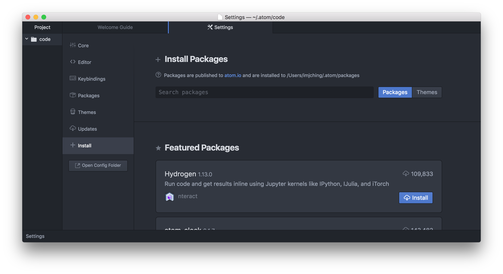
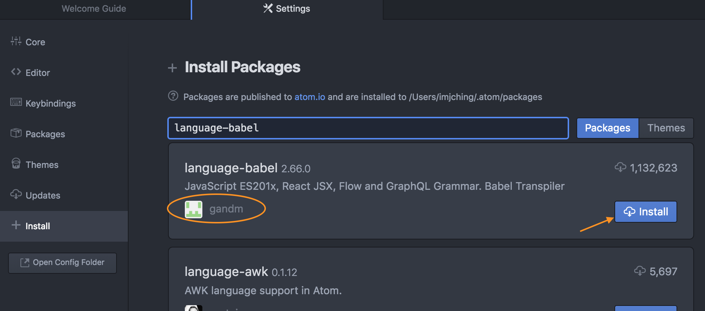

## Setting up Atom for React

1. Open up the `Preferences` or `Settings` menu

    - **Mac** Under `Atom` > `Preferences`
    - **Windows** Under `File` > `Settings`

1. Go to the `+ Install` tab

    

1. Search for `language-babel` where it says **Search packages** and
  then click `Install`

    

1. Congratulations! You have performed the minimal Atom setup required for React.

   Now, let's move on to Tic Tac Toe!
