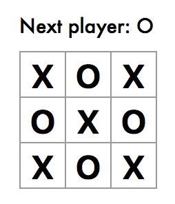
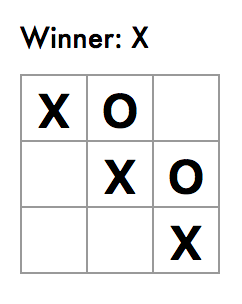
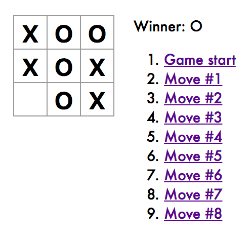
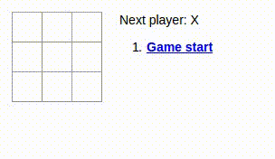
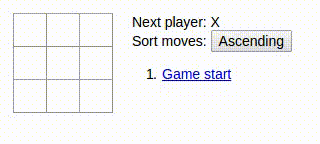

# Make Tic Tac Toe

## Setting up Atom for React

Before we move on, let's set up Atom for React. We won't be using Atom today, but this will be helpful for tomorrow!

[Setting up Atom for React](../setup-atom.md)

## The Game

Today we will be making a Tic Tac Toe game in React - the "Hello World" equivalent for real programmers (saying "Hello world!" just isn't impressive enough anymore). By the end of this exercise you will have:
1. A clickable grid where our master strategists can place Xs and Os
1. A status text reflecting the state of the Game
1. A history panel that allows for (pseudo) time travel

There are a lot of code samples to guide you along. Treat them as if they were solutions - **Try your best NOT to look at them unless you've spent some time thinking about the problem**.

Sections:
1. [Install React Development Tools](#part-1-install-react-development-tools)
1. [The Square Component](#part-2-the-square-component)
1. [Lifting State Up](#part-3-lifting-state-up)
1. [Taking Turns](#part-4-taking-turns)
1. [Winner Calculator](#part-5-winner-calculation)
1. [Storing and Showing History](#part-6-storing-and-showing-history)
1. [Time Travel](#part-7-time-travel)
1. [Functional Components](#part-8-functional-components)
1. [Feeling Emboldened?](#part-9-feeling-emboldened)
1. [Maximum Loopiness](#part-10-maximum-loopiness)
1. [A Sorting Problem](#part-11-a-sorting-problem)
1. [Gloat in Victory](#part-12-gloat-in-victory)

## Part 1: Install React Development Tools
Install the React Developer Tools extension for Chrome [here](https://chrome.google.com/webstore/detail/react-developer-tools/fmkadmapgofadopljbjfkapdkoienihi).

This extension allows you to inspect React components, states, props, etc as your app is running. Use this often to check "behind the scenes"!

We will be using [this codepen](https://codepen.io/josephch405/pen/RVdPQw) for this exercise. The result is automatically compiled on the fly as you edit.

<h3 style="border-bottom:none">Remember to click on the Fork button before typing any code or your changes will not be saved! You will need to sign up for a CodePen account, if you have not done so already.</h3>

Ensure that you see **your username** on the top left, i.e. "A Pen by [username]", and not "A PEN BY Joseph Chuang"

Before we begin our board should look like this:


Note that we've already created several components for you beforehand. Read over them carefully and make sure you understand what is being rendered, and how.

## Part 2: The Square Component
### Goal
We want to design a React component called Square - it represents a "grid" in our game, capable of displaying Xs and Os and responding to events.
### Steps
1. From the Board component, change ```renderSquare``` so that we pass a prop called "value" to the Square with value equal to ```i```:

    <details>
      <summary>Show Code</summary>

    ```javascript
    class Board extends React.Component {
        renderSquare(i) {
            return <Square value={i} />;
        }
        ...
    }
    ```

    </details>

1. Change the Square component so that the Square displays the passed-down prop:

    <details>
      <summary>Show Code</summary>

    ```javascript
    class Square extends React.Component {
      render() {
        return (
          <button className="square">
            {this.props.value}
          </button>
        );
      }
    }
    ```

     </details>

    At this point, your app should look like this, meaning that the Board is correctly passing down dummy values (0-8) down to its "children" Squares:

    
1. Change the button so that when clicked, it'll display an alert saying "Szechuan Sauce". Remember that for React components, the "onclick" property is actually "onClick", camel-case. Clicking the squares now should trigger a popup.

    <details>
      <summary>Show Code</summary>

    ```javascript
    class Square extends React.Component {
        render() {
            return (
                <button className="square" onClick={() => alert('click')}>
                    {this.props.value}
                </button>
            );
        }
    }
    ```

    </details>

1. Add a constructor to Square so that it starts with a state; this state contains a certain ```value``` initialized to ```null```:

    <details>
      <summary>Show Code</summary>

    ```javascript
    class Square extends React.Component {
        constructor(props) {
            super(props);
            this.state = {
                value: null,
            };
        }
        ...
    }
    ```

    </details>

    Remember to call ```super(props)``` first in a constructor - this sets up the component correctly.
1. Update the Square```render``` method to display the value from its current state, and then toggle the value on click. We need to replace ```this.props.value``` with ```this.state.value```, and then replace the alert function with ```this.setState({value: 'X'})```:

    <details>
      <summary>Show Code</summary>

    ```javascript
    render() {
        return (
            <button className="square" onClick={() => this.setState({value: 'X'})}>
                {this.state.value}
            </button>
        );
    }
    ```

    </details>

    Our new board should look like the following, after clicking on the squares:

    

## Part 3: Lifting State Up
### Goal

We now need to check if one player has won the game, and alternate placing X and O in the squares. To check if someone has won, we'll need to have the value of all 9 squares in one place, rather than split up across the Square components. The best solution here is to store this state in the Board component instead of in each Square.

When you want to **aggregate data** from multiple children or to have two child components communicate with each other, **move the state upwards** so that it **lives in the parent component**. The parent can then pass the state back down to the children via props, so that the children are always in sync with the parent.

### Steps

1. Add a constructor to the Board and set its initial state to contain an array with 9 nulls, corresponding to the 9 squares (note - just use a one-dimensional array for this! Nested arrays may come later.):

    <details>
      <summary>Show Code</summary>

    ```javascript
    class Board extends React.Component {
        constructor(props) {
            super(props);
            this.state = {
                squares: Array(9).fill(null),
            };
        }
        ...
    }
    ```

    </details>

    We'll fill it in later so that a board looks something like

    ```
    [
        'O', null, 'X',
        'X', 'X', 'O',
        'O', null, null,
    ]
    ```

1. Modify Board's ```renderSquare``` method so that we are passing a value from the Board's ```state``` into the square:

    <details>
      <summary>Show Code</summary>

    ```javascript
    renderSquare(i) {
        return <Square value={this.state.squares[i]} />;
    }
    ```

    </details>

1. Now we need to change what happens when a square is clicked. Since component state is always private, we can't update Board's state directly from Square.

    The usual pattern here is pass down a function from Board to Square that gets called when the square is clicked. Change renderSquare in Board again so that it reads:

    <details>
      <summary>Show Code</summary>

    ```javascript
    renderSquare(i) {
        return (
            <Square
                value={this.state.squares[i]}
                onClick={() => this.handleClick(i)}
            />
        );
    }
    ```

    </details>

    Now we're passing down two props from Board to Square: ```value``` and ```onClick```. The latter is a function that Square can call. Let's make the following changes to Square:

    * Replace ```this.state.value``` with ```this.props.value``` in Square's ```render```.
    * Replace ```this.setState()``` with ```this.props.onClick()``` in Square's ```render```.
    * Delete ```constructor``` definition from Square because it doesn't have state anymore.

    After these changes, the whole Square component looks like this:

    <details>
      <summary>Show Code</summary>

    ```javascript
    class Square extends React.Component {
        render() {
            return (
                <button className="square" onClick={() => this.props.onClick()}>
                    {this.props.value}
                </button>
            );
        }
    }
    ```

    </details>

    Now when the square is clicked, it calls the ```onClick``` function that was passed by Board.

1. Try clicking a square – you should get an error because we haven't defined handleClick yet. Add it to the Board class.

    <details>
      <summary>Show Code</summary>

    ```javascript
    class Board extends React.Component {
        ...
        handleClick(i) {
            const squares = this.state.squares.slice();
            squares[i] = 'X';
            this.setState({squares: squares});
        }
        ...
    }
    ```

    </details>

    We call ```.slice()``` to copy the ```squares``` array instead of **mutating** (or changing the underlying data) the existing array. By keeping our objects **immutable** (or unchanging) we can increase component and overall application performance. For more on immutability click [here](https://facebook.github.io/react/tutorial/tutorial.html#why-immutability-is-important).

    Now you should be able to click in squares to fill them again, but the state is stored in the Board component instead of in each Square.

    Square no longer keeps its own state; it receives its value from its parent Board and informs its parent when it's clicked. We call components like this **controlled components**.

## Part 4: Taking Turns
### Goal
Now we have a game where player x (but not y) can place pieces (and thus always win). We'll have to nerf this - we want the players to take turns.

### Steps
1. Make a new boolean in the Board's state object called ```xIsNext``` - initialize it to ```true``` so that player x plays first.

    <details>
      <summary>Show Code</summary>

    ```javascript
    class Board extends React.Component {
        constructor(props) {
            ...
            this.state = {
                ...
                xIsNext: true,
            };
        }
    }
    ```

    </details>

1. Change the board component's ```handleClick``` so that
    1. The ```squares``` array is updated with the correct player piece
    1. ```xIsNext``` as a state variable is updated

    <details>
      <summary>Show Code</summary>

    ```javascript
    handleClick(i){
        ...
        squares[i] = this.state.xIsNext ? 'X' : 'O';
        this.setState({
            ...
            xIsNext: !this.state.xIsNext,
        });
    }
    ```

    </details>

1. Change the board component's ```render``` method so that the status updates correctly - ie it says "Next player: X" or "Next player: O"

    <details>
      <summary>Show Code</summary>

    ```javascript
    const status = 'Next player: ' + (this.state.xIsNext ? 'X' : 'O');
    ```

    </details>

    At this point, you should be able to play through the game as expected - but without a proper endgame. Let's fix that.

    

## Part 5: Winner Calculation
### Goal
We want the game to stop when one of the players has made a line - one can have too much winning, after all. We want the status text to represent this state.

### Steps
1. Add ```calculateWinner``` to the end of your code - this is a help function that takes in an array representing a board and outputs a winner (x, o) or ```null``` if nobody has won yet.

    <details>
      <summary>Show Code</summary>

    ```javascript
    function calculateWinner(squares) {
        const lines = [
            [0, 1, 2],
            [3, 4, 5],
            [6, 7, 8],
            [0, 3, 6],
            [1, 4, 7],
            [2, 5, 8],
            [0, 4, 8],
            [2, 4, 6],
        ];
        for (let i = 0; i < lines.length; i++) {
            const [a, b, c] = lines[i];
            if (squares[a] && squares[a] === squares[b] && squares[a] === squares[c]) {
                return squares[a];
            }
        }
        return null;
    }
    ```

    </details>

1. Update the ```render``` code in Board so that we first use ```calculateWinner``` to check if someone has won, then update the status accordingly.

    <details>
      <summary>Show Code</summary>

    ```javascript
    render() {
        const winner = calculateWinner(this.state.squares);
        let status;
        if (winner) {
            status = 'Winner: ' + winner;
        } else {
            status = 'Next player: ' + (this.state.xIsNext ? 'X' : 'O');
        }
    }
    ```

    </details>

1. Update the ```handleClick``` method so that if either someone has won *or* the target location is already occupied, then the method would return immediately and change nothing on the board. Remember React will only start a re-render when ```setState``` is called.

    <details>
      <summary>Show Code</summary>

    ```javascript
    handleClick(i) {
        const squares = this.state.squares.slice();
        if (calculateWinner(squares) || squares[i]) {
            return;
        }
        squares[i] = this.state.xIsNext ? 'X' : 'O';
        this.setState({
            squares: squares,
            xIsNext: !this.state.xIsNext,
        });
    }
    ```

    </details>

    After a game has finished our board should look something like this:

    

## Part 6: Storing and Showing History
### Goal
We want to implement a history feature, where we can revisit the board across different points in time. This means that we need to **store**, **show** and **restore** game states. Let's store history in an array like so:

```javascript
history = [
    {
        squares: [
            null, null, null,
            null, null, null,
            null, null, null,
        ]
    },
    {
        squares: [
            null, null, null,
            null, 'X', null,
            null, null, null,
        ]
    },
    // ...
]
```


### Steps
1. We want to move the state up again - from the Board component to the Game component. Initialize the game state in the constructor for Game:

    <details>
      <summary>Show Code</summary>

    ```javascript
    class Game extends React.Component {
        constructor(props) {
            super(props);
            this.state = {
                history: [{
                    squares: Array(9).fill(null),
                }],
                xIsNext: true,
            };
        }

        render() {
            ...
        }
    }
    ```

    </details>

1. Change the Board component so that it takes ```squares``` and ```onClick``` from the Game component, instead of having its own version.
    1. Delete the constructor in Board:
    1. Replace any instance of ```this.state.squares``` with ```this.props.squares``` in ```renderSquare``` for the Board
    1. Replace any instance of ```this.handleClick``` with ```this.props.handleClick``` in ```renderSquare``` for the Board
1. Have the Game component look at the history array and correctly calculate the game's status.

    <details>
      <summary>Show Code</summary>

    ```javascript
    render() {
        const history = this.state.history;
        const current = history[history.length - 1];
        const winner = calculateWinner(current.squares);

        let status;
        if (winner) {
            status = 'Winner: ' + winner;
        } else {
            status = 'Next player: ' + (this.state.xIsNext ? 'X' : 'O');
        }

        return (
            <div className="game">
                <div className="game-board">
                    <Board
                    squares={current.squares}
                    onClick={(i) => this.handleClick(i)}
                />
            </div>
                <div className="game-info">
                    <div>{status}</div>
                    <ol>{/* TODO */}</ol>
                </div>
            </div>
        );
    }
    ```

    </details>

1. Since the Game component is calculating the status, remove the ```<div className="status">``` and the lines calculating the status in the Board's ```render()```. Your new ```render``` should look like this:

    <details>
      <summary>Show Code</summary>

    ```javascript
    render() {
        return (
        <div>
            <div className="board-row">
              ...
            </div>
            ...
        </div>
        );
    }
    ```

    </details>

1. We should also move ```handleClick``` from Board to Game. First, simply cut and paste. Then, since we want to track history-related information, we need

    <details>
      <summary>Show Code</summary>

    ```javascipt
        handleClick(i) {
            const history = this.state.history;
            const current = history[history.length - 1];
            const squares = current.squares.slice();
            if (calculateWinner(squares) || squares[i]) {
                return;
            }
            squares[i] = this.state.xIsNext ? 'X' : 'O';
            this.setState({
                history: history.concat([{
                    squares: squares
                }]),
                xIsNext: !this.state.xIsNext,
            });
        }
    ```

    </details>

1. Show the moves as a list next to the game board. We do this by mapping a history object to a list, then placing it in our final render for the Game component. Your final ```render``` for the Game component should look like this:

    <details>
      <summary>Show Code</summary>

    ```javascript
    render() {
        ...
        const moves = history.map((step, move) => {
            const desc = move ?
                'Move #' + move :
                'Game start';
            return (
                <li>
                <a href="#" onClick={() => this.jumpTo(move)}>{desc}</a>
                </li>
            );
        });
        ...
        return (
            ...
            <div className="game-info">
                <div>{status}</div>
                <ol>{moves}</ol>
            </div>
          </div>
        );
    }
    ```

    </details>

    Now you should be able to view all of the previous moves on our board!

    

## Part 7: Time Travel
### Goal
When we select one of our previous moves the board should display its state at the time of that move. To accomplish this we will use a ```key``` to ensure each element in our list has a unique ID. We'll further discuss keys in a later video.

### Steps
1. For our move list, we already have a unique ID for each step: the number of the move when it happened. In the Game's render method, add the key as ```<li key={move}>``` and the key warning should disappear:

    <details>
      <summary>Show Code</summary>

    ```javascript
    ...
    return (
        <li key={move}>
            <a href="#" onClick={() => this.jumpTo(move)}>{desc}</a>
        </li>
    );
    ...
    ```

    </details>

1. Next we need to add the ```jumpTo``` method that we referenced in part 6.
    1. First add a ```key``` to Game's state to indicate which step we're viewing.

        <details>
          <summary>Show Code</summary>

        ```javascript
        class Game extends React.Component {
            constructor(props) {
                super(props);
                this.state = {
                    history: [{
                        squares: Array(9).fill(null),
                    }],
                    stepNumber: 0,
                    xIsNext: true,
                };
            }
        }
        ...
        ```

        </details>

    1. Next, we'll define the ```jumpTo``` method in Game to update that state. We should also update ```xIsNext``` to ```true``` if the index of the move number is an even number.

        <details>
          <summary>Show Code</summary>

        ```javascript
        ...
        handleClick(i) {
            // this method has not changed
        }

        jumpTo(step) {
            this.setState({
                stepNumber: step,
                xIsNext: (step % 2) ? false : true,
            });
        }

        render() {
            // this method has not changed
        }
        ...
        ```

        </details>

1. Then update stepNumber when a new move is made by adding ```stepNumber: history.length``` to the state update in Game's ```handleClick```:

    <details>
      <summary>Show Code</summary>

    ```javascript
    handleClick(i) {
        const history = this.state.history.slice(0, this.state.stepNumber + 1);
        ...
        this.setState({
            ...
            stepNumber: history.length,
            ...
        });
    }
    ```

    </details>

1. Now you can modify Game's render to read from that step in the history:

    <details>
      <summary>Show Code</summary>

    ```javascript
    render() {
        const history = this.state.history;
        const current = history[this.state.stepNumber];
        const winner = calculateWinner(current.squares);
        ...
    }
    ```

    </details>

If you click any move link now, the board should immediately update to show what the game looked like at that time.

## Part 8: Functional Components
### Goal
Since Square is a component that only uses the ```render``` function, we can convert it into a **functional component**. A sample functional component is shown below:

```javascript
function ComponentName(props){
    return(
        ... //component layout here
    )
}
```
Convert Square into a functional component.

## Part 9: Feeling Emboldened?
### Goal
Bold the currently-selected item in History (so that our time traveling is a little less confusing)



## Part 10: Maximum Loopiness
### Goal
Rewrite Board to use two loops instead of hard-coding the Squares

## Part 11: A Sorting Problem
### Goal
Add a toggle button that lets you choose between sorting the History in ascending/descending order



## Part 12: Gloat in Victory
### Goal
When someone wins, highlight the winning squares


## Credits
This guide was largely based off of the official React tutorial [here](https://facebook.github.io/react/tutorial/tutorial.html)
