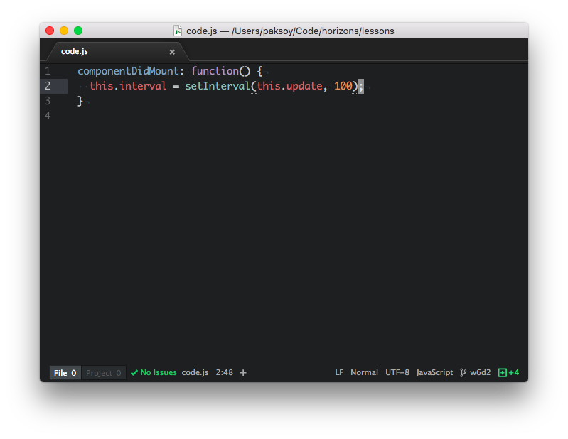

# Warmup Exercises

## Exercise 1: Controlled Form Fields

### Goal

The goal of this exercise is to use controlled form fields
to tie the values of two text input fields together in React.

### Instructions

1. [Open CodePen for this exercise.](https://codepen.io/rick-shar/pen/YQEWBP)

1. There are two text input fields here. We want them to display the same data at all times, with one being all uppercase characters, and another being all lowercase characters. If you change one, the other one should change instantly.

1. Create a new function `change` inside the class. This function should take an `event` argument and update `this.state.text` using `this.setState` to `event.target.value`.

    

1. Add the `onChange={(e) => this.change(e)}` event handler to both form fields.

1. Try changing input fields, they should update at the same time.

1. Now, modify input fields so that one shows uppercase characters whereas another one shows lowercase characters.

    * **Hint:** `value={this.state.text.toLowerCase()}`, `value={this.state.text.toUpperCase()}`

## Exercise 2: Fizz Buzz React Edition

### Goal

The goal of this exercise is to solve a very common programming interview
question using React.

### Instructions

FizzBuzz is a basic programming question asked in many interviews. It involves
printing an increasing sequence of numbers and if statements in React.

1. Open [this CodePen project](https://codepen.io/rick-shar/pen/pwdbBL), fork it so you can save your work.

1. Make `<FizzBuzz />` display a bulleted list (`<ul>`) of `n` numbers (n is a prop).

1. If a given number is divisible by 3 paint it red (CSS `color: red`), if it's divisible by 2 paint it blue, if it's divisible by both 2 and 3 paint it purple. If a number neither divisible by 2 or 3, then display it in black.

1. Your solution should look like this:

    

## Exercise 3: Component Lifecycle: Timer

### Goal

The goal of this exercise is to build a timer by using React
component lifecycle methods.

### Instructions

1. [Open CodePen for this exercise.](https://codepen.io/rick-shar/pen/awVZrx)

1. Implement the `update` function. This function should call `this.setState()` and update `this.state.secondsLeft` to be `(this.state.end - Date.now()) / 1000`.

1. Implement the `componentDidMount` function. Set `this.state.end` to be `this.props.mins` added to the current time, and use `setInterval()` to call `this.update` periodically.

    

1. Implement the `componentWillUnmount` function. Use `clearInterval()` to cancel the background update process.

1. There are two timers on the page, verify that they count down from 1 and 5 minutes respectively.

> Do not worry if the numbers go below zero!
