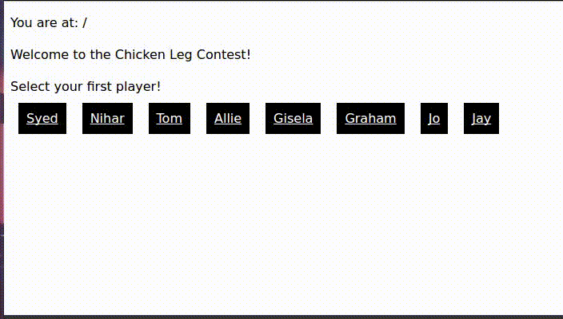

# React Videos

A notes about the exercises today: 

***Read the comments!***

Make sure you at least scan through everything once, and make sure you stay within the proper segments - there's a lot that we set up for you behind the scenes. 

We just want you to understand the relevant Router parts of the exercise - so don't fret if something looks unfamiliar. 

The comments should be detailed enough so that you can work towards the solution on your own.

## React Router Introduction

### [Watch Me](https://vimeo.com/224247223)

## React Router Links

### [Watch Me](https://vimeo.com/224247319)

### [Example 1 - Horizons Portfolio Router](https://codepen.io/josephch405/pen/PjeaQp)

We are developing a site to showcase all of our very serious, professional TAs with very sensible names.

You are given an array of `teamMembers`, and we want to make links for all of them. Example: there should be a `Link` going to `/George`, if George were a teamMember. 

Note that some names have multiple words in them - in such cases, make `Links` that go to `/Barack/Obama` (for "Barack Obama" as a teamMember).

## React Router Routes

### [Watch Me](https://vimeo.com/224247382)

### [Example 2 - Horizons Gallery](https://codepen.io/josephch405/pen/NgzGom)

We would like to have pictures show up for the TAs.

You are given an array of `teamMembers` - but now each object in this array has a `name` and `image` string. The `name` corresponds to a TA's name, and the `image` will be a URL directing to an image.

Using `Link`s, make it so that we have a list of links like exercise 1.

Then, using `Route`s with `render`s, render the correct image when the user visits a certain route. For example - visiting `/Jo` means that I will see a picture of Jo (and only Jo!) on screen.

## Advanced React Router Routes

### [Watch Me](https://vimeo.com/224247460)

### [Example 3 - Very Important and Serious Contest](https://codepen.io/smitgw11/pen/ZXRbYo)

To Properly demonstrate the prowess of our TAs, we are organizing a Chicken Leg eating contest.

You are given an array of `teamMembers` - each object in the array contains a `name` and `speed` - the speeds are numbers, representing Chicken Legs per Second.

This exercise is a bit less guided than the two before. The final result should resemble something like this:

Pay attention to how clicking the `Links` changes the route. 

There are several components labeled `(suggested)` in the exercises. They're simply suggestions on where to start - feel free to implement your own way of doing it. All we require is that going to `/Bob/Pam` somehow shows me results of a Chicken Leg contest between Bob and Pam.
