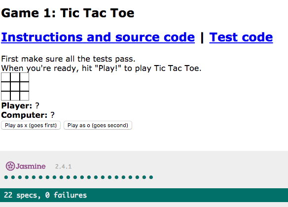
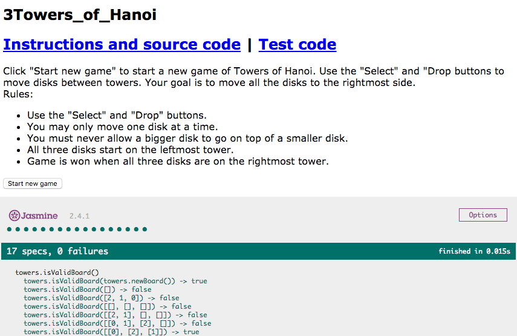

# JavaScript Basic Exercises 2.0 JavaScript Games

## Table of Contents

1. [Tic Tac Toe](#tictactoe)
1. [Hangman](#hangman)
1. [Towers of Hanoi](#towers)

## <a id="tictactoe">Tic Tac Toe</a>

### [Download Exercise][tictactoe-dl]

First [download this exercise][tictactoe-dl].
In this exercise we're building a game of [Tic Tac Toe][tictactoe] in
the browser. Code and instructions are in [`1Tic_Tac_Toe.js`](1Tic_Tac_Toe.js)
and tests are in [`1Tic_Tac_Toe_tests.js`](1Tic_Tac_Toe_tests.js). To start,
open `1Tic_Tac_Toe.html` in Chrome.

The functions you're supposed to implement in `1Tic_Tac_Toe.js` are marked
`YOUR CODE HERE` and are near the top of the file. There are some other
functions that have already been implemented for you and they fall in two
categories:

 * **Game State Functions:** functions for tracking the game through the turns
 * **Browser Interaction Functions:** functions for updating the browser and
   getting updates from the browser

### Tic Tac Toe Functions

Here are all the functions defined for Tic Tac Toe. The functions you have to
implement are marked :star:.

 * `tictactoe.errorIfNotXOrO(xOrO)`: Take a string and generate an error if that string is not 'x' or 'o'.
 * :star: `tictactoe.getOtherSide(xOrO)`: Take a side ('x' or 'o') and returns the other side.
 * `tictactoe.newBoard()`: Create a new game board with no moves made.
 * :star: `tictactoe.makeMove(board, row, column, xOrO)`: Take a board and return a new board with a move made in the specified row, column and side (xOrO).
 * :star: `tictactoe.getResult(board)`: Return the result (or lack thereof) of the current game based on the current state of the board.
 * :star: `tictactoe.getComputerMove(board, computerSide)`: Get the move the computer is going to make.
 * `tictactoe.isGameOver()`: Return true if the game is over. The game is over if there's a tie or if either side has won.
 * `tictactoe.startGame(playerSide)`: Start a new tic tac toe game where the player has the given side.
 * `tictactoe.makePlayerMove(row, column)`: Make a player move at the specified row and column.
 * `tictactoe.makeComputerMove()`:  Make a computer move.
 * `tictactoe.drawBoard()`: Update the page with all game information.
 * `tictactoe.updateResult()`:  Update game result on the browser page, as in "Player won," "Computer won," "Tie," or "Game in progress."
 * `tictactoe.playerMoveClick(evt)`:  Handle the player clicking on the tic tac toe board.

### Tic Tac Toe Operation

The game of Tic Tac Toe operates in a loop performing the following actions:

1. Player clicks one of the "Play" buttons. This button calls `tictactoe.startGame()`.
1. (Assuming player goes first) Player clicks on the game board to make a move.
   This calls `tictactoe.playerMoveClick()` which in turn calls `tictactoe.makePlayerMove()`.
   The board is updated with `tictactoe.makeMove()`, game board is redrawn with `tictactoe.drawBoard()`.
1. For the computer's turn, game calls `tictactoe.makeComputerMove()` which in turn calls `tictactoe.getComputerMove()`.
   The board is updated with `tictactoe.makeMove()`, game board is redrawn with `tictactoe.drawBoard()`.
1. The previous two steps are repeated until `tictactoe.isGameOver()` returns true and game is over.

## <a id="hangman">Hangman</a>

### [Download Exercise][hangman-dl]

First [download this exercise][hangman-dl].
In this exercise we're be building [Hangman][hangman] in the browser.
Like in the previous Tic Tac Toe exercise, some of the functions have
already been implemented for you but this time there's more left for you to
do.

Code and instructions are in [`2Hangman.js`](2Hangman.js). Tests are in
[`2Hangman_tests.js`](2Hangman_tests.js). To Start, open `2Hangman.html` in
Chrome.

The functions you're supposed implement are marked "YOUR CODE HERE".  You will
find them near the top of `2Hangman.js`.  Other functions are further below in
three sections:

 * Helper Functions
 * Game State Functions
 * Browser Functions

### Hangman Functions

The functions you have to implement are marked :star:.

 * :star: `hangman.isGuessWrong(word, guess)`: Return true if guess is wrong, as in the guessed letter (guess) is not in word.
 * `hangman.getRandomInteger(min, max)`: Returns a random integer between min (included) and max (excluded).
 * :star: `hangman.getRandomWord()`: Returns a random word from hangman.words.
 * :star: `hangman.getGameStatus(word, guesses)`: Take a word and an array of guesses and returns a string indicating the game state.
 * :star: `hangman.startGame()`: Start a new game of hangman.
 * :star: `hangman.makeGuess(letter)`:  This function is called when the player makes a guess.
 * `hangman.drawGame()`: Update the browser to display the latest state of the game.
 * `hangman.playerLetterClick(event)`:  This function is called when the player clicks on a letter to make a guess.
 * `hangman.resetButtons()`: Letters become disabled when the player clicks on them, when a new game starts, this function re-enables them.

### Hangman Operation

Hangman operates in a loop performing the following actions:

1. Player clicks "New Game." This calls `hangman.startGame()`, which uses
   `hangman.getRandomWord()` to pick a word and updates the display with
   `hangman.drawGame().
2. Player clicks a letter. This calls `hangman.playerLetterClick()` which in
   turn calls `hangman.makeGuess()` which updates list of guesses and calls `hangman.drawGame()`.
3. Last step is repeated until the player wins or loses.
   `hangman.getGameStatus()` is used to figure out if player has won or lost.

## <a id="towers">Towers of Hanoi</a>

### [Download Exercise][towers-dl]

First [download this exercise][towers-dl].
In this exercise we're building the game of [Towers of Hanoi][towers] in the browser.
Very few functions are have been implemented for you this time.

The rules of Towers of Hanoi are:

 * You may only move one disk at a time.
 * You must never allow a bigger disk to go on top of a smaller disk.
 * All three disks start on the leftmost tower.
 * Game is won when all three disks are on the rightmost tower.

Functions in this file are split into three groups.

 * Game Functions
 * Browser Functions You Will Call
 * Browser Functions You Won't Call

You only need to look at the first two groups (Game and Browser Functions You
Will Call), you can ignore the third group.

### Towers of Hanoi Functions

The functions you have to implement are marked :star:.

 * `towers.newBoard()`: Create new Towers of Hanoi board in the starting state.
 * `towers.isArray(something)`: Return true if 'something' is an array, otherwise return false.
 * `towers.isNumber(something)`: Return true if 'something' is a number, otherwise return false.
 * :star: `towers.isValidBoard(board)`: Return true if the given board is valid, false otherwise.
 * :star: `towers.newGame()`:  Start a new game of Towers of Hanoi.
 * `towers.copyBoard(board)`: Make a copy of the given board and return it.
 * :star: `towers.makeMove(fromTower, toTower)`: Move the disk at the top of fromTower to the top of toTower.
 * `towers.drawGame(board)`: Take a game board and draw it in the browser.
 * `towers.win()`: Update the browser to indicate that the player has successfully completed the game. 
 * `towers.clearWin()`: Update the browser to remove the win message.
 * `towers.select(i)`: Select tower to move a disk FROM.
 * `towers.drop(i)`: Select tower to move the disk TO. 
 * `towers.newGameClick()`:  Called when player clicks new game button.

### Towers of Hanoi Operation

Hangman operates in a loop performing the following actions:

1. Player clicks 'New Game'. This calls `towers.newGameClick()` which calls
   `towers.newGame()` which creates a new board with `towers.newBoard()` and
   updates the display with `towers.drawGame()`.
1. Player clicks a 'Select' button below a tower to select a tower to move
   from. This calls `towers.select()`.
1. Player clicks a 'Drop' button below a tower to select a tower to move the
   disk to. This calls `towers.drop()` which in turn calls `towers.makeMove()`
   to validate and update the move. If the move is valid, the display is
   updated with `towers.drawGame()`.
1. The previous two steps are repeated until the player wins, then `towers.win()` is called.

[towers]: https://en.wikipedia.org/wiki/Tower_of_Hanoi
[hangman]: https://en.wikipedia.org/wiki/Hangman_(game)
[tictactoe]: https://en.wikipedia.org/wiki/Tic-tac-toe
[tictactoe-dl]: https://horizons-static.s3.amazonaws.com/prepwork/3_js_arcade/1Tic_Tac_Toe.zip
[hangman-dl]: https://horizons-static.s3.amazonaws.com/prepwork/3_js_arcade/2Hangman.zip
[towers-dl]: https://horizons-static.s3.amazonaws.com/prepwork/3_js_arcade/3Towers_of_Hanoi.zip
