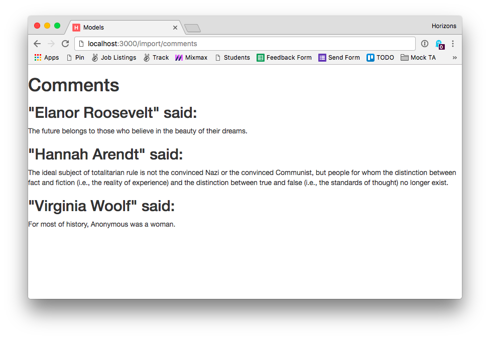

# Inline exercise: Comments and authors

## Goal

The goal of this exercise is to use [Mongoose references](http://mongoosejs.com/docs/populate.html)
to display comments with authors.

## Instructions

1. Edit `/week05/day1/comments/app.js`
1. Finish defining the `Comment` model, add a property called `author`
  that [references](http://mongoosejs.com/docs/populate.html) the `Author`
  model.
1. Edit the `GET /` endpoint and modify the query to populate the `author`
  field.
1. Load data into MongoDb by visiting
  [localhost:3000/import/comments](http://localhost:3000/import/comments)
1. You should be the names of the authors and the comments:

  
