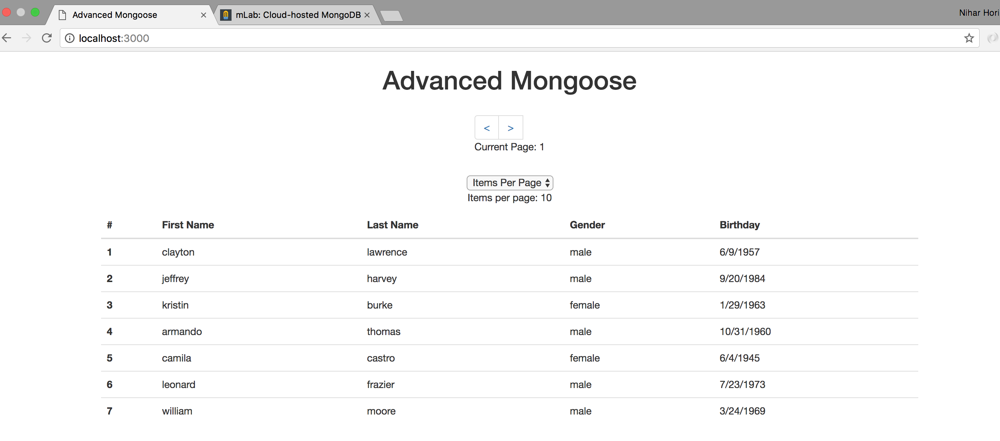

# Advanced Mongoose Self Directed Exercise Part I

---

**Make sure to complete the exercises in the order they are presented.
They build off of each other.**

## Setup

1. Create an `env.sh` file in `week04/day2/examples/part1`

1. Set up your `MONGODB_URI` in `env.sh`

1. Source your env.sh file by running `source env.sh` from the terminal

1. Install dependencies with `npm install`

---

## Section 1: `exec()`

### [Watch me](https://vimeo.com/album/4604349/video/218865713)

The Exec function helps us execute chained and singular Mongoose queries.

1. Run `npm start` in the terminal to start our server

1. Go to `localhost:3000` in your browser, notice that our browser window
looks like

    

    Screenshot
    

    

    

1. Open `week04/day2/examples/part1/server.js` in Atom

1. Modify the `GET /` route to use `.exec()` to execute the User query

1. Refresh the browser window. It should look the exact same!

---

## Section 2: `skip`
### [Watch me](https://vimeo.com/album/4604349/video/218869227)

The Skip function helps us skip over a specified number of documents in mongoose queries.

1. Go to `localhost:3000` in your browser, notice that our browser window
looks like

    

    Screenshot
    

    

    

1. Modify the `GET /` route in `server.js` to skip over the first 7 User documents

    Your output in the browser should now look like

    

    Screenshot
    

    

    

---

## Section 3: `limit()`
### [Watch me](https://vimeo.com/album/4604349/video/218974241)

The limit function helps us limit the number of documents that are returned.

1. Modify the `GET /` route in `server.js` to skip over the first 7 users
and limit the number users returned to 7

    Your output in the browser should now look like

    

    Screenshot
    

    

    

---

## Section 4: `sort()`
### [Watch me](https://vimeo.com/album/4604349/video/219183796)

The sort function helps us sort the returned documents

1. Modify the `GET /` route in `server.js` to sort users by their first name,
skip the first 7 and display the next 7 users

    

    Hint
    

    Sort based on a property of an object inside a document by using the dot
    notation i.e. `sort({'name.last': -1})` (reverse sort by last name)

    

    Your output in the browser should now look like

    

    Screenshot
    

    

    

1. Modify the `GET /` route in `server.js` to display the 7 oldest users

    Your output in the browser should now look like

    

    Screenshot
    

    

    

---

## Section 5: Paginate

1. Using a combination of the above functions, alphabetically sort users by
first name and paginate the data

    Two variables are provided for you `pageNumber` and `limit`

    `pageNumber` indicates which page of users is currently being displayed.
    The first page has index `1`.

    `limit` indicates how many users should be displayed per page (i.e.
    Items Per Page).

    

    Hint
    

    The number of users you `.skip()` depends on both "items per page" and
    the current page index.

    

1. **Results:**

    If you are displaying 10 items per page, your output should look like
    [this](http://www.giphy.com/gifs/l0IydfuFRBj7pqxCE/fullscreen);

    If you are displaying 15 items per page, your output should look like
    [this](http://www.giphy.com/gifs/3ohzdMi1UiBdVAKidy/fullscreen).
