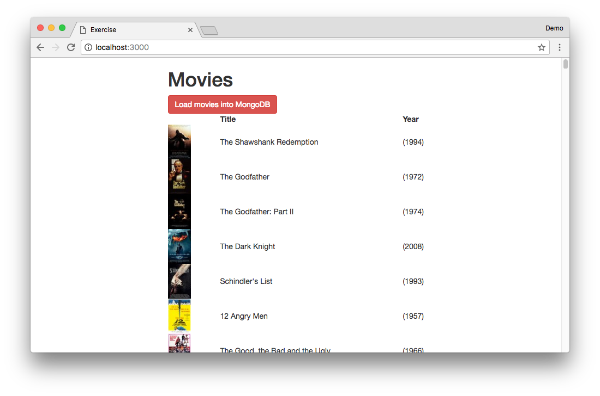

# Pair Programming Exercise: MongoDB Loader

## Goal

The goal of the exercise is to use `Promise.all()` to wait for a large
number of async requests to finish.

## Steps

1. Create your `env.sh` and add set `MONGODB_URI`
1. Edit `week05/day1/mongo-loader/app.js` and update the `POST /load` route.

    `week05/day1/mongo-loader/movies.json` contains an array of movie objects.
    Use the provided `Movie` mongoose model to save all movies in `movies.json` to MongoDB.
    
    Try using [`Promise.all()`](https://developer.mozilla.org/en-US/docs/Web/JavaScript/Reference/Global_Objects/Promise/all)
    to save all the movies.

    

    Hint
    

    1. Use `Array.prototype.map()` to convert the array of movie objects into an
    array of promises using the mongoose function `.save()`.

        `.save()` returns a promise.

    1. Pass the promise array into `Promise.all()` to wait for all movies to
    finish saving.

    

1. Start your app and load it in your browser and click
`Load movies into MongoDB`. You should see:

    

    Screenshot
    

    
    

